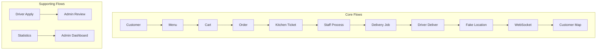
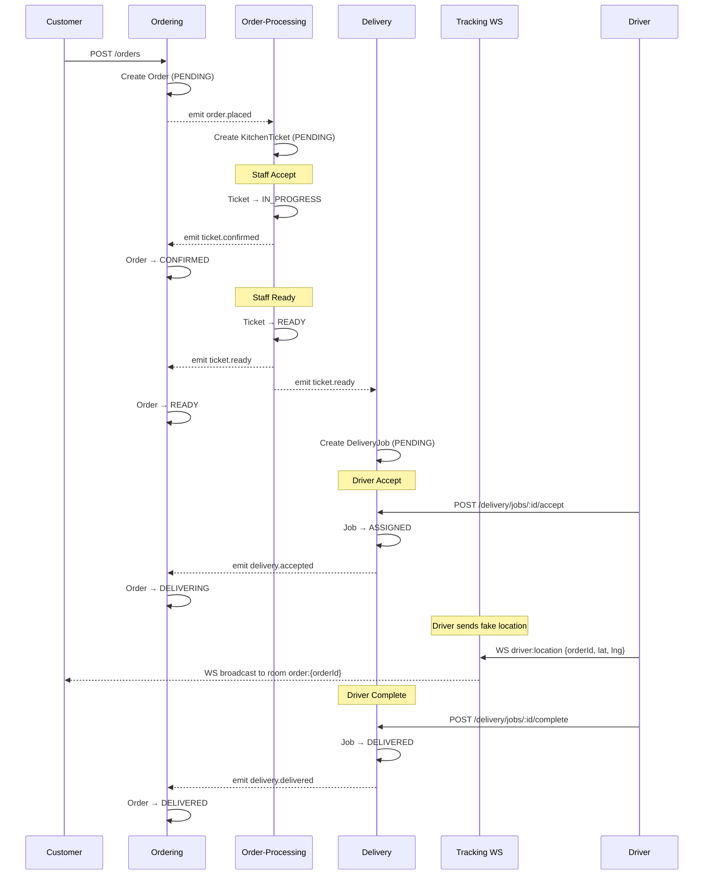

# Real-time Food Delivery (Modular Monolith + Event-Driven)

Real-time Food Delivery app với 4 nhóm actor:

- **Customer**: đặt món, theo dõi đơn hàng real-time
- **Staff**: nhận/duyệt đơn, chuẩn bị món
- **Driver**: nhận đơn giao, cập nhật trạng thái + vị trí
- **Admin**: dashboard, approve driver, thống kê

## Tech Stack

- **Backend**: NestJS + MongoDB + Mongoose
- **Realtime**: WebSocket (Nest Gateway) + internal Event-driven (NestJS EventEmitter2)
- **Frontend**: Next.js 16 (App Router) + React 19
- **Maps**: OpenStreetMap + Leaflet.js

## Project Scope

> **Demo-only**: 4-7 concurrent users, happy path focused, không production.
> **Team**: 4 interns, 11 weeks.
> **Architecture**: Simplified for learning - Modular Monolith + Event-Driven.

---

# Architecture Overview

## 1. Modular Monolith + Ownership + Event-Driven

Dự án là **1 backend deployable** (monolith), nhưng code được chia theo **modules** (Option A / domain-per-module).

### Ownership (Single-writer)

Mỗi collection trong MongoDB có **1 module sở hữu (own)** và chỉ module đó được **write** trực tiếp vào collection đó.

Ví dụ (core modules):
- `ordering` owns: `orders`
- `order-processing` owns: `kitchenTickets`
- `delivery` owns: `deliveryAssignments`, `drivers`
- `tracking` owns: `trackingSessions`, `driverLocations` (persist)

> **Lưu ý:** Module khác muốn thay đổi dữ liệu owned-by-module khác => **không update trực tiếp DB/model**; phải đi qua **Domain Events**.

### Event-driven internal

Các module giao tiếp bằng **Domain Events** chạy nội bộ qua `@nestjs/event-emitter`.

**Simplified event pattern** (không dùng class/abstract base):

```typescript
// Publish: emit string key + plain object payload
this.eventEmitter.emit('order.placed', { 
  orderId: '123', 
  items: [...], 
  customerId: 'abc' 
});

// Subscribe: @OnEvent decorator trong Service
@Injectable()
export class OrderProcessingService {
  @OnEvent('order.placed')
  handleOrderPlaced(payload: { orderId: string; items: any[]; customerId: string }) {
    // Tạo KitchenTicket...
  }
}
```

**6 cross-module events:**
1. `order.placed` → Order-Processing tạo ticket
2. `ticket.confirmed` → Ordering: order CONFIRMED
3. `ticket.rejected` → Ordering: order CANCELLED
4. `ticket.ready` → Ordering: order READY + Delivery: tạo job
5. `delivery.accepted` → Ordering: order DELIVERING
6. `delivery.delivered` → Ordering: order DELIVERED

## 2. Simplified Module Structure

Mỗi module được tổ chức theo pattern **Controller → Service → Schema** (flat structure):

```text
modules/{module-name}/
├── {module}.module.ts          # Module registration
├── {module}.controller.ts      # REST endpoints (thin)
├── {module}.service.ts         # Business logic + @OnEvent handlers
└── {entity}.schema.ts          # Mongoose schema (= Entity)
```

**Không dùng**: ~~boundary/~~, ~~control/~~, ~~entity/~~, ~~ports/~~, ~~infrastructure/~~, ~~UseCase classes~~, ~~Repository ports~~

> **Rule:**
> - Controller chỉ: validate DTO, gọi Service, trả response
> - Service chứa: business logic, gọi Mongoose Model, emit events, @OnEvent handlers
> - Schema = Mongoose schema + Entity (không tách riêng)

---

# 6 Flows Overview

Dự án được chia thành 6 flows:

## Core Flows

| Flow | Tên | Mô tả | Modules |
|------|-----|-------|---------|
| **Flow 1** | Ordering | Customer đặt hàng → Menu, Cart, Order | `ordering` |
| **Flow 2** | Order Processing | Staff xử lý đơn → Accept/Reject/Ready | `order-processing` |
| **Flow 3** | Delivery | Driver nhận đơn → Accept, Pickup, Complete | `delivery` |
| **Flow 4** | Tracking | Realtime location → Driver gửi vị trí, Customer xem map | `tracking` |

## Supporting Flows

| Flow | Tên | Mô tả | Modules |
|------|-----|-------|------|
| **Flow 5** | Driver Recruitment | Driver apply → Admin approve/reject | `auth` + `delivery` |
| **Flow 6** | Admin Dashboard | Statistics + Menu Management | `admin` |



---

# Repository Structure

## Root

```text
food-delivery/
├── backend/          # NestJS API + WS + event-driven
├── frontend/         # Next.js app
├── scripts/          # helper scripts (github issues, etc.)
└── .github/          # issue templates
```

## Backend

```text
backend/src/
├── infrastructure/
│   ├── config/           # ConfigModule + env validation
│   └── mongo/            # MongoModule
├── eventing/
│   ├── eventing.module.ts    # EventEmitterModule
│   └── events/               # Event payload interfaces (optional)
└── modules/
    ├── auth/
    │   ├── auth.module.ts
    │   ├── auth.controller.ts
    │   ├── auth.service.ts
    │   ├── user.schema.ts
    │   ├── guards/           # JwtAuthGuard, RolesGuard
    │   ├── strategies/       # JwtStrategy
    │   └── decorators/       # @Public(), @Roles()
    ├── ordering/
    │   ├── ordering.module.ts
    │   ├── ordering.controller.ts
    │   ├── ordering.service.ts    # @OnEvent handlers
    │   ├── order.schema.ts
    │   └── menu-item.schema.ts
    ├── order-processing/
    │   ├── order-processing.module.ts
    │   ├── order-processing.controller.ts
    │   ├── order-processing.service.ts
    │   └── kitchen-ticket.schema.ts
    ├── delivery/
    │   ├── delivery.module.ts
    │   ├── delivery.controller.ts
    │   ├── delivery.service.ts
    │   ├── delivery-assignment.schema.ts
    │   └── driver.schema.ts
    └── tracking/
        ├── tracking.module.ts
        └── tracking.gateway.ts    # WebSocket Gateway
```

---

# Frontend Architecture & Structure (Next.js)

Frontend sử dụng **Pure Feature-Based Architecture** — domain modules trong `features/`, shared UI trong `components/`.

## 1. Routing theo Actor (App Router)

Routes được nhóm theo actor:

- `(customer)` : Menu, Cart, Orders, Order Tracking
- `(staff)`    : Kitchen Tickets Queue
- `(driver)`   : Delivery Jobs, Apply
- `(admin)`    : Dashboard, Driver Approval, Menu Management

## 2. Feature Modules

Mỗi feature module chứa:

```text
features/{feature}/
├── {feature}.service.ts    # API calls
├── use{Feature}.ts         # Custom hook
├── {Feature}Context.tsx    # React Context (if needed)
├── {Component}.tsx         # UI components
└── index.ts                # Barrel export
```

**Modules:**
- `features/auth/` → Login, AuthContext, useAuth
- `features/menu/` → MenuList, MenuItemCard, useMenu
- `features/cart/` → CartContext, CartList, useCart
- `features/orders/` → OrderList, OrderDetail, OrderStatusBadge
- `features/staff/` → TicketQueue, TicketCard
- `features/driver/` → JobList, JobCard, DriverApply
- `features/tracking/` → TrackingMap (Leaflet.js)
- `features/admin/` → StatsCards, DriverTable, MenuTable

## 3. Shared Components

`components/` chỉ chứa **non-domain** shared components:

- `components/ui/` — shadcn/ui primitives (Button, Card, Input...)
- `components/layout/` — Header, Sidebar, BottomNav, PageContainer
- `components/shared/` — PageHeader

> **Rule:** 
> - Pages import từ `features/` (qua barrel export `index.ts`)
> - Features import từ `lib/api.ts` (HTTP client) và `components/ui/`
> - **KHÔNG** để domain components trong `components/`

See [docs/frontend-architecture.md](docs/frontend-architecture.md) for detailed rules.

### Modules mapping to flows

- **Flow 1** → `features/menu/`, `features/cart/`, `features/orders/`
- **Flow 2** → `features/staff/`
- **Flow 3** → `features/driver/`
- **Flow 4** → `features/tracking/`
- **Flow 5** → `features/driver/` + `features/admin/`
- **Flow 6** → `features/admin/`

---

# Getting Started

## Requirements

- Node.js (LTS)
- MongoDB (local or Docker)

## Backend

### 1. Install

```bash
cd backend
npm install
```

### 2. Environment

Tạo file `.env` trong `backend/`:

```env
PORT=3001
MONGO_URI=mongodb://localhost:27017/food_delivery
JWT_SECRET=your-secret-key-change-in-production
```

### 3. Seed Data

```bash
npm run seed
```

Tạo 4 test users (customer/staff/driver/admin @test.com, pass: 123456) + 10 menu items.

### 4. Run

```bash
npm run start:dev
```

> - API: `http://localhost:3001/api`
> - CORS enabled cho `http://localhost:3000` (frontend)

## Frontend

```bash
cd frontend
npm install
npm run dev
```

---

# Conventions (để không phá kiến trúc)

## 1. No cross-module DB access

- Module A **không** được import schema/model/repo của module B.
- Muốn “tác động” module khác => publish **Domain Event**.

## 2. Backend: Flat module structure

- Mỗi module: `{module}.module.ts`, `{module}.controller.ts`, `{module}.service.ts`, `{entity}.schema.ts`
- **Không** tạo thêm subfolder: ~~boundary/~~, ~~control/~~, ~~entity/~~, ~~ports/~~, ~~infrastructure/~~
- Controller thin: chỉ validate, gọi Service, trả response
- Service chứa business logic + @OnEvent handlers

## 3. Frontend: Pure feature-based

- Domain modules nằm trong `features/` (VD: `features/cart/`, `features/menu/`)
- `components/` chỉ chứa shared UI/layout, **không** chứa domain logic
- Pages import từ `features/` qua barrel export `index.ts`

## 4. Events are facts

- Event mô tả "điều đã xảy ra" (VD: `order.placed`, `ticket.ready`).
- Không dùng event như "command" ra lệnh module khác.
- Emit với string key + plain object payload (không dùng class/base class)

---

---

# API Endpoints Summary

See [plans/milestone-plan.md](plans/milestone-plan.md) for detailed task breakdown.

### Auth (`@Public()` cho register/login)
- `POST /api/auth/register` → `{ token, user }`
- `POST /api/auth/login` → `{ token, user }`
- `GET /api/auth/me` → `{ id, email, role, name }`

### Ordering (Flow 1)
- `GET /api/menu` — Public, filter: `?category=Main`
- `POST /api/orders` — Customer role, emit `order.placed`
- `GET /api/orders/my` — Customer role
- `GET /api/orders/:id` — Authenticated

### Order Processing (Flow 2)
- `GET /api/tickets` — Staff role, filter: `?status=PENDING`
- `POST /api/tickets/:id/accept` — Staff, emit `ticket.confirmed`
- `POST /api/tickets/:id/reject` — Staff, body: `{reason}`
- `POST /api/tickets/:id/ready` — Staff, emit `ticket.ready`

### Delivery (Flow 3)
- `GET /api/delivery/jobs` — Driver role (PENDING jobs)
- `POST /api/delivery/jobs/:id/accept` — Driver, emit `delivery.accepted`
- `POST /api/delivery/jobs/:id/pickup` — Driver
- `POST /api/delivery/jobs/:id/complete` — Driver, emit `delivery.delivered`

### Tracking (Flow 4)
- `WS driver:location` — Driver emit `{orderId, lat, lng}`
- `WS tracking:subscribe` — Customer join room `{orderId}`

### Driver Recruitment (Flow 5)
- `POST /api/drivers/apply` — Customer role
- `GET /api/admin/drivers` — Admin role
- `POST /api/admin/drivers/:id/approve` — Admin
- `POST /api/admin/drivers/:id/reject` — Admin

### Admin Dashboard (Flow 6)
- `GET /api/admin/stats` — Admin role
- `POST /api/admin/menu` — Admin
- `PUT /api/admin/menu/:id` — Admin
- `DELETE /api/admin/menu/:id` — Admin (soft delete)

---

# Event Flow Diagram



---

# Notes

- **Demo-scope**: 4-7 concurrent users, happy path only, no pagination/polling/complex error handling
- **Event-Driven**: `EventEmitter2` + `@OnEvent()` directly. 6 events cho cross-module communication.
- **Tracking**: Fake GPS location (dropdown presets), không dùng `navigator.geolocation`
- **Frontend**: Feature-based pattern. `features/` chứa domain modules, `components/` chỉ shared UI/layout.
- **Backend**: Flat structure. Controller → Service → Schema. No BCE/Port/Adapter/UseCase classes.
- **Refresh**: Manual refresh (button hoặc F5) thay vì polling/auto-refresh
- **WebSocket**: Query param `token` cho auth, không cần WS middleware phức tạp
- Tracking persist `driverLocations` để có thể đọc lại "last location"/audit khi cần.

See [plans/milestone-plan.md](plans/milestone-plan.md) for detailed 48-task breakdown.
