# Frontend Data Flow Diagram

## Tổng quan kiến trúc Frontend

Dự án sử dụng **Next.js 16** với **App Router** và **Feature-Based Architecture**.

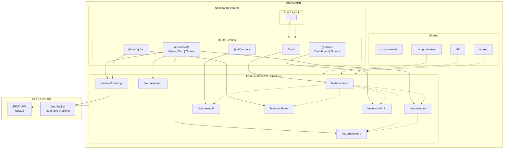

## Feature-Based Architecture Pattern

Mỗi feature là một module độc lập chứa đầy đủ các thành phần:

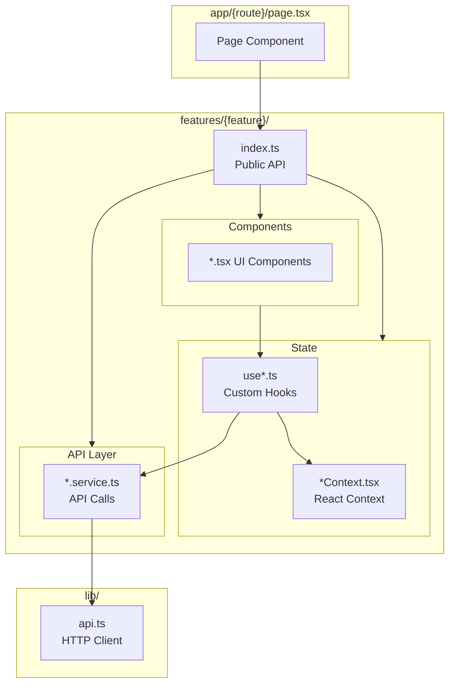

## Chi tiết Data Flow theo Feature

### 1. Auth Feature

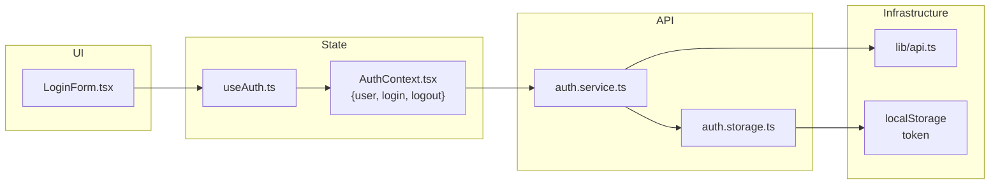

**Data Flow:**
1. User nhập credentials → `LoginForm`
2. Gọi `useAuth().login(data)`
3. `AuthContext` gọi `authService.login()`
4. Service gọi API → nhận `{token, user}`
5. `authStorage.setToken(token)` → lưu localStorage
6. `AuthContext` cập nhật `user` state
7. Toàn app re-render với auth mới

### 2. Cart Feature

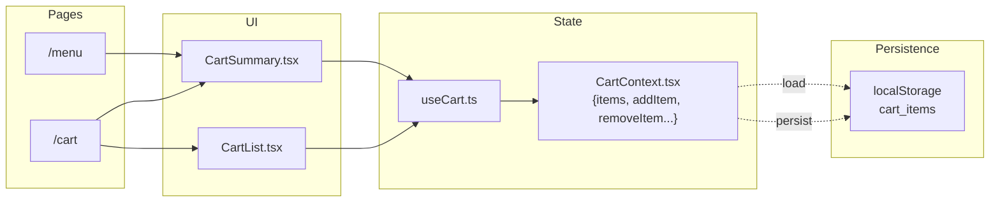

**Data Flow:**
1. Customer thêm item → `addItem(menuItem, qty)`
2. `CartContext` cập nhật `items` state
3. `useEffect` lưu `localStorage.setItem('cart_items')`
4. Cart icon tự động cập nhật số lượng
5. Reload page → `cartItemsFromStorage()` khôi phục cart

### 3. Orders Feature

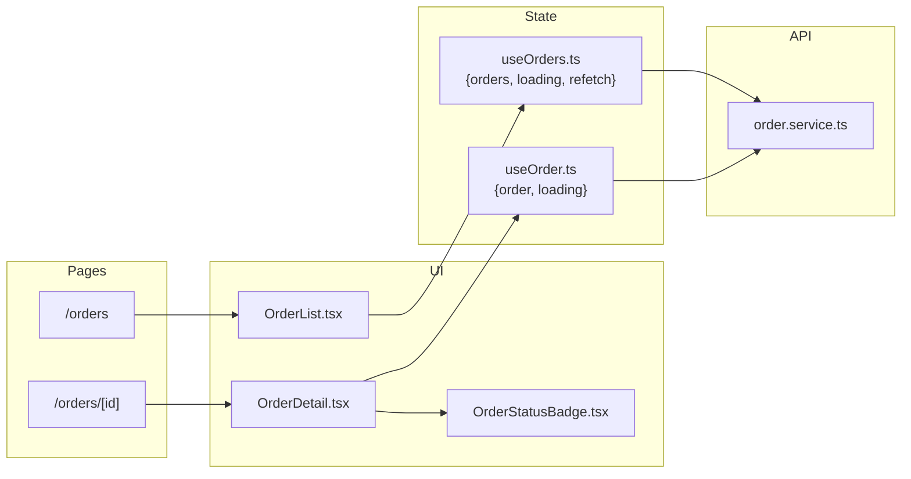

**Data Flow:**
1. Page mount → `useEffect` gọi `orderService.getMyOrders()`
2. Service gọi `GET /orders/my`
3. Data trả về → cập nhật `orders` state
4. Component render list
5. Click order → navigate `/orders/[id]`
6. `useOrder(id)` gọi `orderService.getById(id)`
7. Component render chi tiết

### 4. Staff Feature

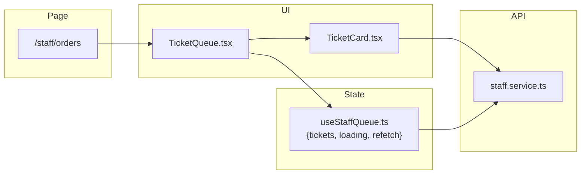

**Data Flow:**
1. Staff mở `/staff/orders`
2. `useStaffQueue()` gọi `staffService.getQueue()`
3. API trả về danh sách `KitchenTicket[]`
4. Render `TicketCard` cho mỗi ticket
5. Staff click Accept → `staffService.acceptTicket(id)`
6. API cập nhật → `refetch()` reload queue

### 5. Driver Feature

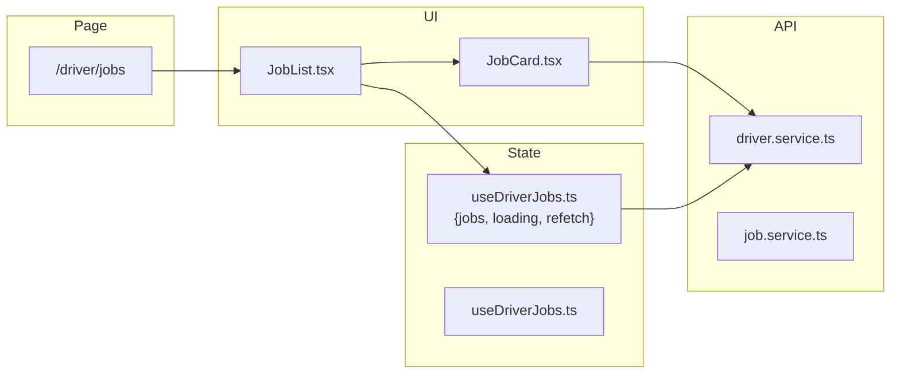

**Data Flow:**
1. Driver mở `/driver/jobs`
2. `useDriverJobs()` gọi `driverService.getMyJobs()`
3. API trả về `DeliveryJob[]`
4. Driver click Accept → `driverService.acceptJob(jobId)`
5. Sau đó có thể: `pickupJob()` → `deliverJob()`

### 6. Tracking Feature (Real-time)

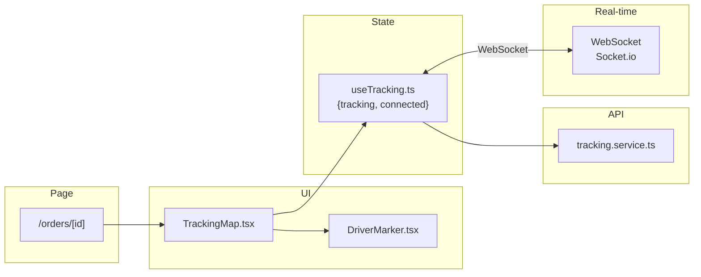

**Data Flow:**
1. Customer mở order tracking
2. `useTracking(orderId)` khởi tạo WebSocket
3. Socket emit `track_order` event
4. Server broadcast `tracking_update` khi có thay đổi
5. `driver_location` events cập nhật vị trí real-time
6. Map re-render với marker mới

## Context Providers Flow

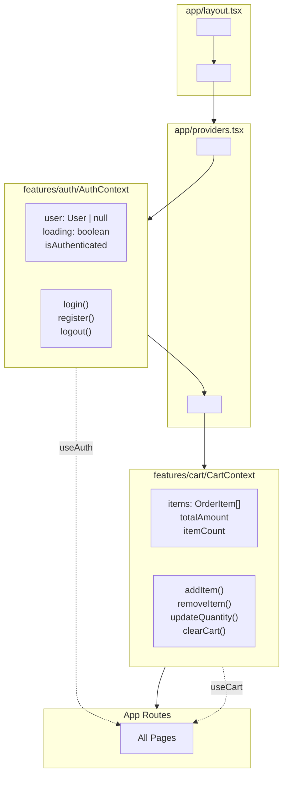

## API Layer Architecture

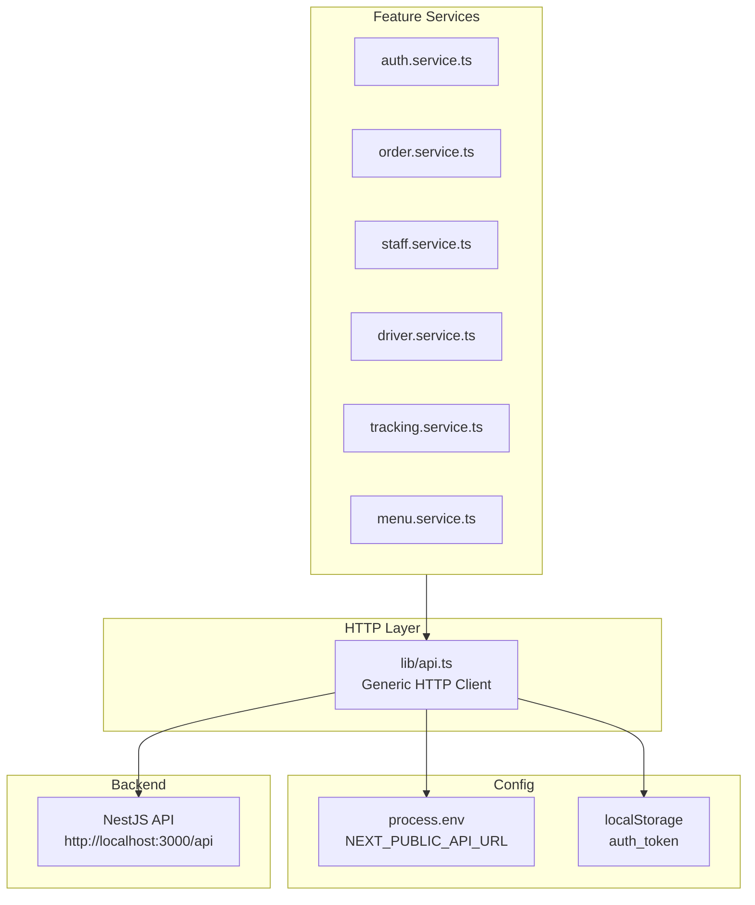

## Data Flow Patterns

### Pattern 1: Server State (useEffect + Service)

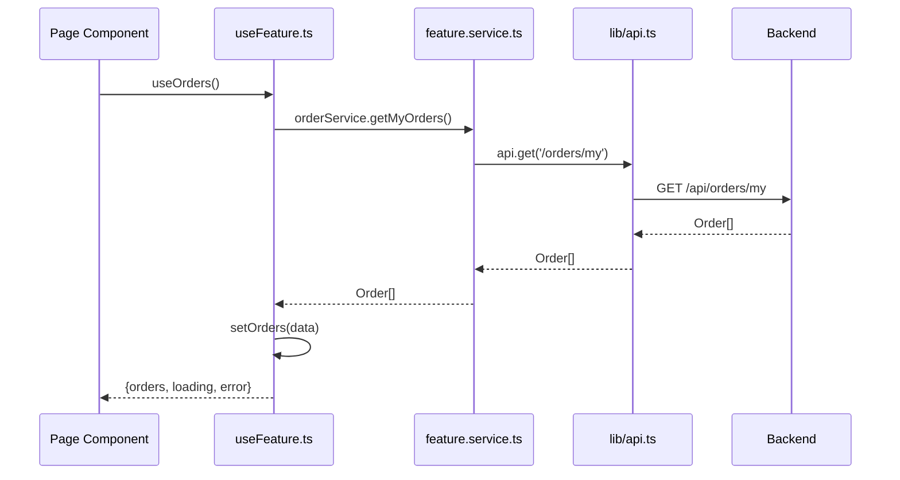

### Pattern 2: Client State (Context + localStorage)

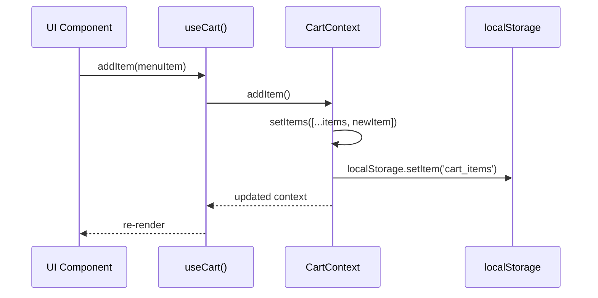

### Pattern 3: Authentication Flow

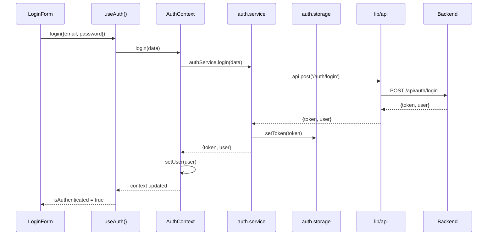

### Pattern 4: Real-time Tracking Flow

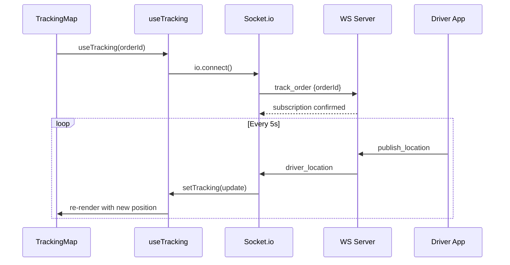

## Directory Structure

```
frontend/src/
├── app/                          # Next.js App Router
│   ├── (admin)/                  # Route group: Admin
│   │   ├── dashboard/page.tsx
│   │   └── drivers/page.tsx
│   ├── (customer)/               # Route group: Customer
│   │   ├── page.tsx              # Home
│   │   ├── menu/page.tsx
│   │   ├── cart/page.tsx
│   │   └── orders/
│   │       ├── page.tsx
│   │       └── [id]/page.tsx
│   ├── (driver)/                 # Route group: Driver
│   │   └── jobs/
│   │       ├── page.tsx
│   │       └── [orderId]/page.tsx
│   ├── (staff)/                  # Route group: Staff
│   │   └── tickets/page.tsx
│   ├── login/page.tsx
│   ├── layout.tsx                # Root layout
│   ├── providers.tsx             # Context providers
│   └── globals.scss
├── components/                   # Shared (non-domain) components
│   ├── layout/                   # Layout wrappers
│   │   ├── Header.tsx
│   │   ├── BottomNav.tsx
│   │   ├── Sidebar.tsx
│   │   ├── PageContainer.tsx
│   │   └── index.ts
│   ├── shared/                   # Shared generic components
│   │   └── PageHeader.tsx
│   └── ui/                       # shadcn/ui primitives
│       ├── Badge.tsx
│       ├── Button.tsx
│       ├── Card.tsx
│       ├── Dialog.tsx
│       ├── Input.tsx
│       ├── Label.tsx
│       ├── Modal.tsx
│       ├── Spinner.tsx
│       └── index.ts
├── features/                     # Feature-Based Architecture
│   ├── auth/                     # Auth feature
│   │   ├── AuthContext.tsx       # React Context
│   │   ├── auth.service.ts       # API calls
│   │   ├── auth.storage.ts       # localStorage
│   │   ├── useAuth.ts            # Hook
│   │   ├── LoginForm.tsx         # UI Component
│   │   └── index.ts              # Public API
│   ├── cart/                     # Cart feature
│   │   ├── CartContext.tsx
│   │   ├── CartList.tsx
│   │   ├── CartSummary.tsx
│   │   └── index.ts
│   ├── menu/                     # Menu feature
│   │   ├── menu.service.ts
│   │   ├── useMenu.ts
│   │   ├── MenuList.tsx
│   │   ├── MenuItemCard.tsx
│   │   └── index.ts
│   ├── orders/                   # Orders feature
│   │   ├── order.service.ts
│   │   ├── useOrders.ts
│   │   ├── OrderList.tsx
│   │   ├── OrderDetail.tsx
│   │   └── index.ts
│   ├── staff/                    # Staff feature
│   │   ├── staff.service.ts
│   │   ├── useStaffQueue.ts
│   │   ├── TicketQueue.tsx
│   │   ├── TicketCard.tsx
│   │   └── index.ts
│   ├── driver/                   # Driver feature
│   │   ├── driver.service.ts
│   │   ├── job.service.ts
│   │   ├── useDriverJobs.ts
│   │   ├── JobList.tsx
│   │   ├── JobCard.tsx
│   │   └── index.ts
│   ├── tracking/                 # Tracking feature
│   │   ├── tracking.service.ts
│   │   ├── useTracking.ts
│   │   ├── TrackingMap.tsx
│   │   ├── DriverMarker.tsx
│   │   └── index.ts
│   └── admin/                    # Admin feature
│       ├── admin.service.ts
│       ├── useAdminStats.ts
│       ├── StatsCards.tsx
│       ├── DriverTable.tsx
│       └── index.ts
├── lib/                          # Utilities
│   ├── api.ts                    # HTTP Client
│   ├── constants.ts
│   └── utils.ts
├── types/                        # TypeScript types
│   ├── index.ts
│   ├── user.ts
│   ├── menu.ts
│   ├── order.ts
│   ├── ticket.ts
│   └── delivery.ts
└── styles/
    └── globals.scss
```

## Quy ước Data Flow

### 1. Feature Module Convention

```typescript
// features/{feature}/index.ts - Public API
export { FeatureProvider } from './FeatureContext';
export { useFeature } from './useFeature';
export { featureService } from './feature.service';
export { FeatureComponent } from './FeatureComponent';
```

### 2. Service Pattern

```typescript
// features/{feature}/{feature}.service.ts
import { api } from '@/lib/api';

export const featureService = {
  async getAll(): Promise<Data[]> {
    return api.get<Data[]>('/endpoint');
  },
  async create(data: CreateRequest): Promise<Data> {
    return api.post<Data>('/endpoint', data);
  },
  async update(id: string, data: UpdateRequest): Promise<Data> {
    return api.patch<Data>(`/endpoint/${id}`, data);
  },
  async delete(id: string): Promise<void> {
    return api.delete<void>(`/endpoint/${id}`);
  },
};
```

### 3. Hook Pattern

```typescript
// features/{feature}/use{Feature}.ts
'use client';
import { useState, useEffect } from 'react';
import { featureService } from './feature.service';

export function useFeature() {
  const [data, setData] = useState<Data[]>([]);
  const [loading, setLoading] = useState(true);
  const [error, setError] = useState<string | null>(null);

  const loadData = async () => {
    setLoading(true);
    setError(null);
    try {
      const result = await featureService.getAll();
      setData(result);
    } catch (err) {
      setError(err instanceof Error ? err.message : 'Failed to load');
    } finally {
      setLoading(false);
    }
  };

  useEffect(() => {
    loadData();
  }, []);

  return { data, loading, error, refetch: loadData };
}
```

### 4. Context Pattern (nếu cần global state)

```typescript
// features/{feature}/{Feature}Context.tsx
'use client';
import { createContext, useState, useContext } from 'react';

interface ContextValue {
  state: State;
  actions: Actions;
}

const Context = createContext<ContextValue | undefined>(undefined);

export function FeatureProvider({ children }) {
  const [state, setState] = useState(initialState);
  
  const actions = {
    action1: () => { /* ... */ },
    action2: () => { /* ... */ },
  };
  
  return (
    <Context.Provider value={{ state, actions }}>
      {children}
    </Context.Provider>
  );
}

export function useFeatureContext() {
  const ctx = useContext(Context);
  if (!ctx) throw new Error('Must be used within Provider');
  return ctx;
}
```

### 5. Data Flow Summary

| Layer | Responsibility | Example |
|-------|---------------|---------|
| **Page** | Routing & Layout | `app/(customer)/orders/page.tsx` |
| **Component** | UI Rendering | `OrderList.tsx`, `OrderCard.tsx` |
| **Hook** | Business Logic & State | `useOrders.ts`, `useOrder(id)` |
| **Context** | Global State (if needed) | `AuthContext.tsx`, `CartContext.tsx` |
| **Service** | API Communication | `order.service.ts` |
| **API Client** | HTTP Request | `lib/api.ts` |
