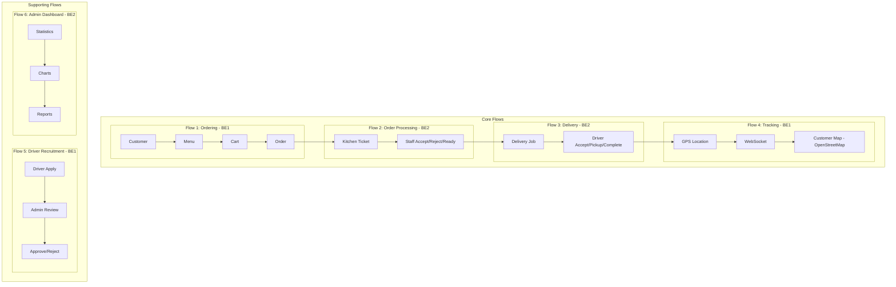
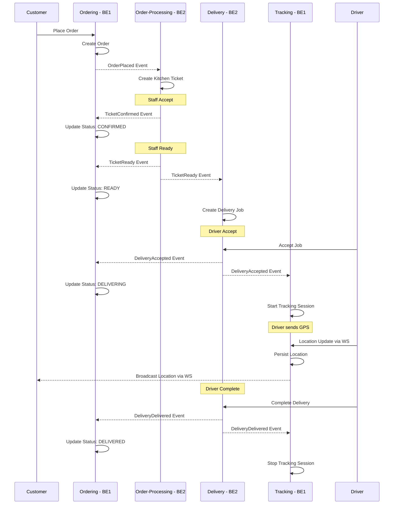
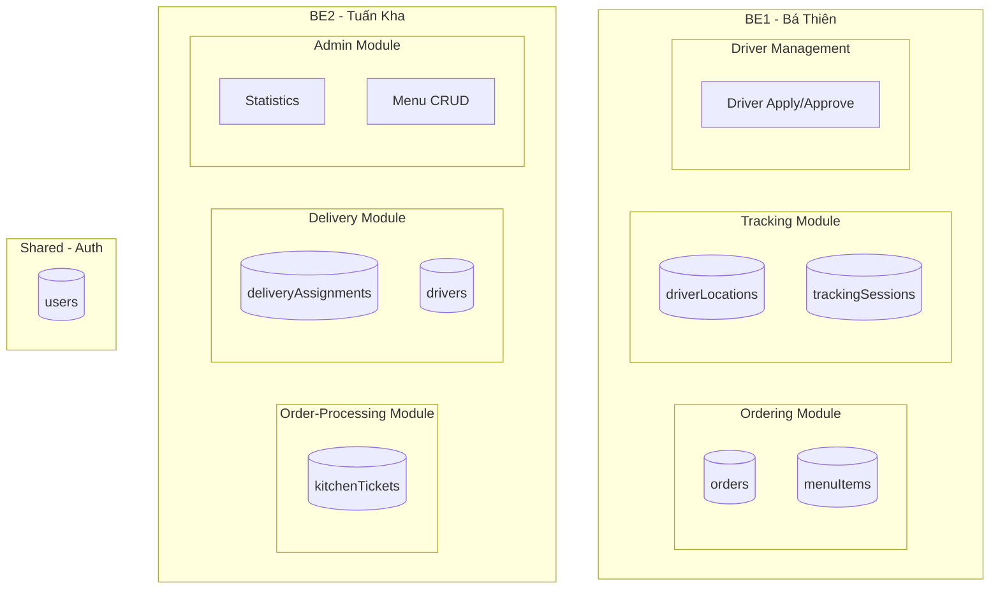

# Food Delivery - Milestone Plan (Tuần 1-11)

## Tổng quan Team & Phân công

| Thành viên | Vai trò | Flows phụ trách | Modules |
|------------|---------|-----------------|---------|
| **Thanh Phúc (FE1)** | Frontend Lead | FE cho Flow 1, 2, 5 | Customer UI, Staff UI, Driver Apply |
| **Tuấn Kiệt (FE2)** | Frontend Developer | FE cho Flow 3, 4, 6 | Driver UI, Tracking Map, Admin UI |
| **Bá Thiên (BE1)** | Backend Developer | Flow 1, 4, 5 | Ordering, Tracking, Driver Recruitment |
| **Tuấn Kha (BE2)** | Backend Developer | Flow 2, 3, 6 | Order-Processing, Delivery, Admin Stats |

## 6 Flows

### Core Flows
| Flow | Tên | Mô tả | Backend | Frontend |
|------|-----|-------|---------|----------|
| **Flow 1** | Ordering | Customer đặt hàng → Menu, Cart, Order | BE1 | FE1 |
| **Flow 2** | Order Processing | Staff xử lý đơn → Queue, Accept/Reject/Ready | BE2 | FE1 |
| **Flow 3** | Delivery | Driver nhận đơn → Jobs, Accept, Pickup, Complete | BE2 | FE2 |
| **Flow 4** | Tracking | Realtime GPS → Driver location, Customer tracking | BE1 | FE2 |

### Supporting Flows
| Flow | Tên | Mô tả | Backend | Frontend |
|------|-----|-------|---------|----------|
| **Flow 5** | Driver Recruitment | Driver apply → Admin approve/reject | BE1 | FE1 + FE2 |
| **Flow 6** | Admin Dashboard | Statistics, Reports, Management | BE2 | FE2 |

## Tech Stack

- **Backend**: NestJS + MongoDB (Mongoose), Modular Monolith + Event-Driven
- **Frontend**: Next.js 16 + React 19, Feature modules (BCE pattern)
- **Realtime**: WebSocket (Nest Gateway)
- **Maps**: OpenStreetMap (Leaflet.js)

---

## Flow Overview Diagram



---

# Milestone 1: Foundation + Flow 1 (Tuần 1-4)

**Mục tiêu**: Setup project hoàn chỉnh + Customer có thể đặt hàng end-to-end

**Demo cuối M1**: Customer login → xem menu → thêm vào cart → place order → xem order status

## Tuần 1-2: Foundation + Auth

| Task | Task Description | Assignment | Output | Status |
|------|------------------|------------|--------|--------|
| M1-BE-01 | **Project Setup**: Tạo `.env` (MONGO_URI, JWT_SECRET, PORT). Hoàn thiện ConfigModule với env validation. MongoModule với connection retry. Thêm `GET /health` verify DB connection. | BE1 + BE2 | Health check endpoint hoạt động | ⬜ |
| M1-BE-02 | **EventingModule**: Định nghĩa `EventBusPort` interface với method `publish<T>(event: T): void`. Implement `EventBusEventEmitter` adapter dùng EventEmitter2. Tạo base `DomainEvent` class (eventId, occurredOn, eventType). | BE1 | Event bus có thể inject và publish | ⬜ |
| M1-BE-03 | **Auth Module**: User schema (email, passwordHash, role: CUSTOMER/STAFF/DRIVER/ADMIN, createdAt). `POST /auth/register` hash password bcrypt, validate email unique. `POST /auth/login` verify + return JWT {userId, role, exp: 7d}. `GET /auth/me` return user info. | BE2 | 3 auth endpoints hoạt động | ⬜ |
| M1-BE-04 | **Authorization Guards**: Tạo `@Roles(...roles)` decorator. `JwtAuthGuard` verify token và attach user to request. `RolesGuard` check payload.role. `@Public()` decorator cho public endpoints. Setup global: JwtAuthGuard → RolesGuard. | BE2 | Protected routes chặn unauthorized | ⬜ |
| M1-BE-05 | **Seed Users**: Script tạo 4 test users mỗi role (customer@test.com, staff@test.com, driver@test.com, admin@test.com). Password: "123456". Chạy được nhiều lần không duplicate. | BE1 + BE2 | `npm run seed` tạo 4 users | ⬜ |
| M1-FE-01 | **Next.js Setup**: Khởi tạo Next.js 16 với App Router. Cấu hình TypeScript, ESLint, Prettier. Setup folder structure theo BCE pattern. | FE1 | `npm run dev` chạy được | ⬜ |
| M1-FE-02 | **API Infrastructure**: Tạo API client với axios/fetch wrapper trong `lib/`. Auth storage (localStorage). Auto attach JWT header. Handle 401 redirect to login. | FE1 | `src/lib/api.ts`, `src/lib/auth-storage.ts` hoàn chỉnh | ⬜ |
| M1-FE-03 | **Route Groups**: Tạo route groups `(customer)`, `(staff)`, `(driver)`, `(admin)`. Mỗi group có layout riêng. Setup middleware check role. | FE1 + FE2 | 4 route groups với layouts | ⬜ |
| M1-FE-04 | **Login Page**: Form login (email, password). Gọi `POST /auth/login`. Lưu JWT vào storage. AuthContext với user state + login/logout methods. Redirect theo role sau login. | FE1 | `/login` hoạt động end-to-end | ⬜ |
| M1-FE-05 | **Route Protection**: Middleware check JWT valid. Redirect về /login nếu chưa auth. Redirect về trang phù hợp nếu sai role (vd: customer vào /admin → redirect). | FE2 | Unauthorized access bị chặn | ⬜ |

## Tuần 3-4: Flow 1 - Ordering (BE1 + FE1)

| Task | Task Description | Assignment | Output | Status |
|------|------------------|------------|--------|--------|
| M1-BE-06 | **Ordering Module**: Tạo folder structure BCE (boundary/control/entity). Order entity với fields: customerId, items[], totalAmount, status, deliveryAddress, createdAt. OrderStatus enum: PENDING, CONFIRMED, PREPARING, READY, DELIVERING, DELIVERED, CANCELLED. | BE1 | `src/modules/ordering/` structure | ⬜ |
| M1-BE-07 | **Order Repository**: Mongoose schema cho Order. `OrderRepoMongo` implement interface với methods: save(), findById(), findByCustomerId(), updateStatus(). | BE1 | `orders` collection hoạt động | ⬜ |
| M1-BE-08 | **Menu Module**: MenuItem schema (name, description, price, category, imageUrl, available). Seed 10+ menu items với categories (Appetizer, Main, Drink, Dessert). `GET /menu` trả list có thể filter by category. | BE1 | `GET /menu` trả danh sách món | ⬜ |
| M1-BE-09 | **PlaceOrderUseCase**: Validate items tồn tại và available. Tính totalAmount từ menu prices. Tạo Order với status PENDING. Publish `OrderPlacedEvent` qua EventBus. Return orderId. | BE1 | `POST /orders` tạo order + emit event | ⬜ |
| M1-BE-10 | **GetOrderUseCase**: Lấy order by ID. Check ownership (customer chỉ xem order của mình, staff/admin xem all). Return order với items populated (name, price). | BE1 | `GET /orders/:id` với authorization | ⬜ |
| M1-BE-11 | **GetCustomerOrdersUseCase**: Lấy danh sách orders của customer. Support pagination (page, limit). Sort by createdAt desc. Filter by status optional. | BE1 | `GET /orders?customerId=&status=&page=` | ⬜ |
| M1-FE-06 | **Menu Page**: Fetch và hiển thị danh sách món từ API. Filter tabs theo category. Search by name. Loading skeleton khi fetch. | FE1 | `/(customer)/menu` hiển thị menu | ⬜ |
| M1-FE-07 | **MenuItemCard**: Component hiển thị 1 món (image, name, price, description truncate). Nút "Add to Cart" với quantity selector. Hiện badge nếu đã có trong cart. | FE1 | Component reusable | ⬜ |
| M1-FE-08 | **Cart State**: CartContext quản lý cart items. useCart hook với methods: addItem, removeItem, updateQuantity, clearCart, getTotal. Persist cart vào localStorage. | FE1 | Cart state hoạt động across pages | ⬜ |
| M1-FE-09 | **Cart Page**: Hiển thị cart items với quantity controls. Hiện subtotal, delivery fee, total. Form nhập delivery address. Nút "Place Order" disabled nếu cart empty. | FE1 | `/(customer)/cart` hoàn chỉnh | ⬜ |
| M1-FE-10 | **Checkout Flow**: Gọi `POST /orders` với cart items + address. Handle loading state. Clear cart on success. Redirect đến order detail page. Show error toast nếu fail. | FE1 | Đặt hàng thành công end-to-end | ⬜ |
| M1-FE-11 | **Order Detail Page**: Fetch order by ID. Hiển thị status badge, items list, total, delivery address. Polling mỗi 10s để update status (hoặc prepare cho WebSocket). | FE2 | `/(customer)/orders/[orderId]` | ⬜ |
| M1-FE-12 | **Order History**: Fetch danh sách orders của customer. Hiện list cards với status, date, total. Click vào navigate đến detail. Pagination hoặc infinite scroll. Empty state nếu chưa có order. | FE2 | `/(customer)/orders` với list | ⬜ |

### M1 Deliverables
- ✅ Backend + Frontend chạy được
- ✅ Auth hoạt động với 4 roles
- ✅ Customer đặt hàng thành công
- ✅ Order status hiển thị đúng

---

# Milestone 2: Flow 2 - Staff Workflow (Tuần 5-6)

**Mục tiêu**: Staff có thể xử lý đơn hàng (Accept/Reject/Ready)

**Demo cuối M2**: Customer đặt → Staff thấy ticket → Accept/Reject/Ready → Customer thấy status đổi

## Tuần 5: Order Processing Backend (BE2)

| Task | Task Description | Assignment | Output | Status |
|------|------------------|------------|--------|--------|
| M2-BE-01 | **Order-Processing Module**: Tạo folder structure BCE. Module độc lập, không import trực tiếp từ Ordering module. Giao tiếp qua events. | BE2 | `src/modules/order-processing/` | ⬜ |
| M2-BE-02 | **KitchenTicket Entity**: Fields: orderId, items[], status, staffId (nullable), createdAt, acceptedAt, readyAt. TicketStatus enum: PENDING, IN_PROGRESS, READY, REJECTED. | BE2 | Entity + Mongoose schema | ⬜ |
| M2-BE-03 | **OrderEventsSubscriber**: Listen `OrderPlacedEvent`. Tạo KitchenTicket mới với status PENDING. Copy items từ order. Log ticket created. | BE2 | Ticket tự động tạo khi order placed | ⬜ |
| M2-BE-04 | **GetPendingTicketsUseCase**: Lấy danh sách tickets có thể filter by status. Sort by createdAt asc (FIFO). Populate order info (customerName, address). Staff role required. | BE2 | `GET /tickets?status=PENDING` | ⬜ |
| M2-BE-05 | **GetTicketByIdUseCase**: Lấy chi tiết ticket với full order info. Include items với tên món, quantity. Staff role required. | BE2 | `GET /tickets/:id` | ⬜ |
| M2-BE-06 | **AcceptTicketUseCase**: Validate ticket status = PENDING. Update status → IN_PROGRESS, set staffId, acceptedAt. Publish `TicketConfirmedEvent` với {ticketId, orderId, staffId}. | BE2 | `POST /tickets/:id/accept` | ⬜ |
| M2-BE-07 | **RejectTicketUseCase**: Validate ticket status = PENDING. Update status → REJECTED. Require reason field. Publish `TicketRejectedEvent` với {ticketId, orderId, reason}. | BE2 | `POST /tickets/:id/reject` | ⬜ |
| M2-BE-08 | **MarkReadyUseCase**: Validate ticket status = IN_PROGRESS. Update status → READY, set readyAt. Publish `TicketReadyEvent` với {ticketId, orderId, items}. | BE2 | `POST /tickets/:id/ready` | ⬜ |
| M2-BE-09 | **TicketEventsSubscriber (Ordering)**: Listen ticket events trong Ordering module. TicketConfirmed → order CONFIRMED. TicketRejected → order CANCELLED. TicketReady → order READY. | BE1 | Order status sync với ticket | ⬜ |
| M2-BE-10 | **Event Contracts**: Định nghĩa class-based events trong `src/eventing/events/`. TicketConfirmedEvent, TicketRejectedEvent, TicketReadyEvent với typed payload. | BE1 + BE2 | Event classes có TypeScript types | ⬜ |

## Tuần 6: Staff UI (FE1)

| Task | Task Description | Assignment | Output | Status |
|------|------------------|------------|--------|--------|
| M2-FE-01 | **Staff Queue Page**: Layout 2 columns: Pending tickets (left), In-Progress tickets (right). Count badge trên mỗi column. Auto-fetch on mount. | FE1 | `/(staff)/orders` với queue layout | ⬜ |
| M2-FE-02 | **Ticket List Component**: Hiển thị list tickets với: order ID, customer name, items count, created time (relative: "5 phút trước"). Filter dropdown by status. | FE1 | Component với filter hoạt động | ⬜ |
| M2-FE-03 | **Ticket Detail Page**: Hiển thị full ticket info: items list với quantity, customer address, timestamps. Action buttons based on status. Back button về queue. | FE1 | `/(staff)/orders/[orderId]` | ⬜ |
| M2-FE-04 | **Action Buttons**: PENDING: Accept + Reject buttons. IN_PROGRESS: Ready button. Reject cần confirmation modal với reason input. Disable button khi loading. | FE1 | Buttons với confirmation flow | ⬜ |
| M2-FE-05 | **Auto-Refresh**: Polling queue list mỗi 5 giây. Visual indicator "Đang cập nhật...". Không refresh nếu đang ở detail page. Stop polling khi unmount. | FE1 | Queue tự động update | ⬜ |
| M2-FE-06 | **Customer Status Polling**: Trên order detail page (customer), polling status mỗi 10s. Update UI ngay khi status đổi. Toast notify "Đơn hàng đã được xác nhận". | FE2 | Customer thấy status realtime | ⬜ |
| M2-FE-07 | **Status Badge Component**: Shared component hiển thị status với màu. PENDING: yellow, CONFIRMED: blue, PREPARING: orange, READY: green, CANCELLED: red. | FE1 + FE2 | `<StatusBadge status={} />` | ⬜ |
| M2-FE-08 | **Status Mapping Doc**: Document mapping TicketStatus → OrderStatus hiển thị. IN_PROGRESS ticket = PREPARING order. Thêm vào README hoặc docs/. | FE1 | Mapping documented rõ ràng | ⬜ |

### M2 Deliverables
- ✅ Ticket tự động tạo khi có order
- ✅ Staff Accept/Reject/Ready hoạt động
- ✅ Order status sync với ticket status
- ✅ Customer thấy status update

---

# Milestone 3: Flow 3 + Flow 4 - Delivery & Tracking (Tuần 7-8)

**Mục tiêu**: Driver nhận đơn + Realtime GPS tracking với OpenStreetMap

**Demo cuối M3**: Staff READY → Driver accept → Driver gửi location → Customer thấy trên map

## Tuần 7: Delivery (BE2) + Tracking Backend (BE1)

| Task | Task Description | Assignment | Output | Status |
|------|------------------|------------|--------|--------|
| M3-BE-01 | **Delivery Module**: Tạo folder structure BCE. Module độc lập, giao tiếp với Order-Processing qua events. | BE2 | `src/modules/delivery/` | ⬜ |
| M3-BE-02 | **DeliveryAssignment Entity**: Fields: orderId, driverId (nullable), status, pickupAddress, deliveryAddress, createdAt, acceptedAt, pickedUpAt, deliveredAt. Status enum: PENDING, ASSIGNED, PICKED_UP, DELIVERED. | BE2 | Entity + Mongoose schema | ⬜ |
| M3-BE-03 | **Driver Entity**: Fields: userId, status (PENDING, APPROVED, REJECTED), vehicleType, licensePlate, phone, approvedAt. Liên kết với User qua userId. | BE2 | `drivers` collection | ⬜ |
| M3-BE-04 | **TicketEventsSubscriber (Delivery)**: Listen `TicketReadyEvent`. Tạo DeliveryAssignment với status PENDING. Copy addresses từ order. | BE2 | Job tự động tạo khi ticket ready | ⬜ |
| M3-BE-05 | **GetAvailableJobsUseCase**: Lấy danh sách jobs status = PENDING. Sort by createdAt asc. Include order info (items summary, address). Driver role required, driver phải APPROVED. | BE2 | `GET /delivery/jobs` | ⬜ |
| M3-BE-06 | **AcceptDeliveryUseCase**: Validate job PENDING và driver APPROVED. Update status → ASSIGNED, set driverId, acceptedAt. Publish `DeliveryAcceptedEvent` {jobId, orderId, driverId}. | BE2 | `POST /delivery/jobs/:id/accept` | ⬜ |
| M3-BE-07 | **PickupUseCase**: Validate job ASSIGNED và đúng driverId. Update status → PICKED_UP, set pickedUpAt. Publish `DeliveryPickedUpEvent`. | BE2 | `POST /delivery/jobs/:id/pickup` | ⬜ |
| M3-BE-08 | **CompleteDeliveryUseCase**: Validate job PICKED_UP và đúng driverId. Update status → DELIVERED, set deliveredAt. Publish `DeliveryDeliveredEvent`. | BE2 | `POST /delivery/jobs/:id/complete` | ⬜ |
| M3-BE-09 | **Tracking Module**: Tạo folder structure BCE. Quản lý driver location và tracking sessions. | BE1 | `src/modules/tracking/` | ⬜ |
| M3-BE-10 | **Tracking Entities**: LocationPoint (driverId, lat, lng, timestamp). TrackingSession (orderId, driverId, isActive, startedAt, endedAt). | BE1 | Entities defined | ⬜ |
| M3-BE-11 | **Tracking Schemas**: Mongoose schemas cho driverLocations (TTL index 24h) và trackingSessions. Index on orderId + isActive. | BE1 | Collections với indexes | ⬜ |
| M3-BE-12 | **DeliveryEventsSubscriber (Tracking)**: Listen `DeliveryAcceptedEvent` → create active TrackingSession. Listen `DeliveryDeliveredEvent` → close session (isActive=false). | BE1 | Session auto manage | ⬜ |
| M3-BE-13 | **PublishLocationUseCase**: Validate driver có active session. Save LocationPoint. Emit location qua WebSocket để broadcast. Rate limit: max 1 update/3s per driver. | BE1 | Location persistence hoạt động | ⬜ |
| M3-BE-14 | **DeliveryEventsSubscriber (Ordering)**: Listen delivery events trong Ordering module. DeliveryAccepted → order DELIVERING. DeliveryDelivered → order DELIVERED. | BE1 | Order status sync với delivery | ⬜ |

## Tuần 8: WebSocket + Driver/Customer UI

| Task | Task Description | Assignment | Output | Status |
|------|------------------|------------|--------|--------|
| M3-BE-15 | **WebSocket Gateway**: Setup NestJS Gateway với Socket.IO. Namespace `/tracking`. CORS config cho frontend. | BE1 | TrackingGateway class | ⬜ |
| M3-BE-16 | **WS Driver Location**: Event `driver:location` nhận {lat, lng}. Validate driver auth. Call PublishLocationUseCase. Broadcast tới room `order:{orderId}`. | BE1 | Driver emit location hoạt động | ⬜ |
| M3-BE-17 | **WS Customer Subscribe**: Event `tracking:subscribe` với {orderId}. Validate customer owns order. Join room `order:{orderId}`. Send last known location ngay. | BE1 | Customer subscribe hoạt động | ⬜ |
| M3-BE-18 | **WS Auth Middleware**: Verify JWT từ handshake auth. Attach user info to socket. Disconnect nếu invalid token. | BE1 | WS connections authenticated | ⬜ |
| M3-FE-01 | **WebSocket Client**: Setup Socket.IO client. Auto-connect với JWT auth. Reconnect logic on disconnect. Connection status indicator. | FE2 | `src/lib/socket.ts` | ⬜ |
| M3-FE-02 | **Driver Jobs Page**: Fetch available jobs list. Card hiển thị: pickup/delivery address, items count, distance estimate. Pull-to-refresh. Empty state "Không có đơn mới". | FE2 | `/(driver)/jobs` | ⬜ |
| M3-FE-03 | **Driver Job Detail**: Hiển thị full job info: addresses với map preview, items list, customer phone (masked). Status-based action button. | FE2 | `/(driver)/jobs/[orderId]` | ⬜ |
| M3-FE-04 | **Driver Accept Flow**: Button "Nhận đơn" gọi accept API. Loading state. Success → navigate to job detail với status ASSIGNED. Error toast nếu job đã được nhận. | FE2 | Accept job hoạt động | ⬜ |
| M3-FE-05 | **Driver Status Flow**: ASSIGNED: "Đã lấy hàng" button → PICKED_UP. PICKED_UP: "Hoàn thành" button → DELIVERED. Confirmation trước mỗi action. | FE2 | Status transitions hoạt động | ⬜ |
| M3-FE-06 | **Driver Geolocation**: Request permission navigator.geolocation. Watch position với high accuracy. Handle permission denied gracefully. | FE2 | Lấy được GPS position | ⬜ |
| M3-FE-07 | **Driver WS Emit**: Khi có active job (ASSIGNED/PICKED_UP), emit location mỗi 5s qua WebSocket. Stop emit khi job complete. Battery-friendly: reduce frequency khi app background. | FE2 | Auto gửi GPS hoạt động | ⬜ |
| M3-FE-08 | **Customer Tracking Page**: Route `/(customer)/orders/[orderId]/tracking`. Full screen map. Back button về order detail. Only accessible khi order DELIVERING. | FE2 | Tracking page layout | ⬜ |
| M3-FE-09 | **OpenStreetMap Setup**: Integrate Leaflet.js với OpenStreetMap tiles. Map centered on delivery address. Zoom controls. | FE2 | Map renders correctly | ⬜ |
| M3-FE-10 | **WS Subscribe + Marker**: Subscribe to order tracking on mount. Render driver marker với custom icon. Update marker position on location event. Unsubscribe on unmount. | FE2 | Driver marker realtime update | ⬜ |
| M3-FE-11 | **Marker Animation**: Smooth marker movement với animation (không jump). Show driver heading direction. Polyline từ driver → destination. ETA estimate display. | FE2 | Smooth UX hoàn thiện | ⬜ |

### M3 Deliverables
- ✅ Delivery job tự động tạo khi ticket ready
- ✅ Driver Accept/Pickup/Complete hoạt động
- ✅ WebSocket realtime location
- ✅ Customer thấy driver trên OpenStreetMap

---

# Milestone 4: Flow 5 + Flow 6 - Admin & Driver Recruitment (Tuần 9-10)

**Mục tiêu**: Admin dashboard + Driver recruitment workflow + UI polish

**Demo cuối M4**: Driver apply → Admin approve + Dashboard statistics + UX hoàn thiện

## Tuần 9: Flow 5 Driver Recruitment (BE1) + Flow 6 Admin Stats (BE2)

| Task | Task Description | Assignment | Output | Status |
|------|------------------|------------|--------|--------|
| M4-BE-01 | **Driver Apply Endpoint**: `POST /drivers/apply` với body {vehicleType, licensePlate, phone}. Validate user chưa có driver profile. Tạo Driver với status PENDING. Customer role required. | BE1 | Apply endpoint hoạt động | ⬜ |
| M4-BE-02 | **Get Pending Drivers**: `GET /admin/drivers?status=PENDING`. Admin role required. Include user info (name, email). Sort by createdAt asc. | BE1 | List pending applications | ⬜ |
| M4-BE-03 | **Approve Driver**: `POST /admin/drivers/:id/approve`. Validate driver status = PENDING. Update status → APPROVED, set approvedAt. Update User role → DRIVER. | BE1 | Approve hoạt động | ⬜ |
| M4-BE-04 | **Reject Driver**: `POST /admin/drivers/:id/reject` với {reason}. Update status → REJECTED. Không đổi user role. Lưu rejection reason. | BE1 | Reject với reason | ⬜ |
| M4-BE-05 | **Get All Drivers**: `GET /admin/drivers` với filter status optional. Pagination support. Admin role required. | BE1 | Full driver list | ⬜ |
| M4-BE-06 | **Driver Status Validation**: Trong AcceptDeliveryUseCase, check driver.status = APPROVED. Return 403 nếu driver chưa approved. | BE1 | Only approved drivers nhận job | ⬜ |
| M4-BE-07 | **Stats Total Orders**: `GET /admin/stats/orders` return {total, today, thisWeek, thisMonth}. Admin role required. | BE2 | Order count stats | ⬜ |
| M4-BE-08 | **Stats Revenue**: `GET /admin/stats/revenue` return {total, today, thisWeek, thisMonth}. Sum từ completed orders. | BE2 | Revenue stats | ⬜ |
| M4-BE-09 | **Stats Daily Chart**: `GET /admin/stats/daily?days=7` return array [{date, orders, revenue}]. Dùng MongoDB aggregation. | BE2 | Chart data cho 7/30 ngày | ⬜ |
| M4-BE-10 | **Stats By Status**: `GET /admin/stats/by-status` return {PENDING: n, CONFIRMED: n, ...}. Pie chart data. | BE2 | Status distribution | ⬜ |
| M4-BE-11 | **Menu CRUD**: `POST /admin/menu` create item. `PUT /admin/menu/:id` update. `DELETE /admin/menu/:id` soft delete (available=false). Admin role required. | BE2 | Full menu management | ⬜ |

## Tuần 10: Admin UI + Polish

| Task | Task Description | Assignment | Output | Status |
|------|------------------|------------|--------|--------|
| M4-FE-01 | **Admin Dashboard Page**: Layout với sidebar navigation. Main content area. Header với admin name + logout. | FE2 | `/(admin)/dashboard` layout | ⬜ |
| M4-FE-02 | **Stats Summary Cards**: 4 cards: Total Orders, Today Orders, Total Revenue, Active Drivers. Fetch từ stats API. Number animation on load. | FE2 | Summary cards hoạt động | ⬜ |
| M4-FE-03 | **Daily Orders Chart**: Line/Bar chart hiển thị orders + revenue 7 ngày. Toggle 7d/30d. Dùng Chart.js hoặc Recharts. Responsive. | FE2 | Interactive chart | ⬜ |
| M4-FE-04 | **Admin Drivers Page**: Table view danh sách drivers. Columns: Name, Email, Vehicle, Status, Actions. Tab filter: All/Pending/Approved/Rejected. | FE2 | `/(admin)/drivers` | ⬜ |
| M4-FE-05 | **Driver Filter List**: Filter tabs hoạt động. Show count badge mỗi tab. Search by name/email. Pagination. | FE2 | Filter + search hoạt động | ⬜ |
| M4-FE-06 | **Approve/Reject Modal**: Modal confirm approve với driver info summary. Reject modal có textarea nhập reason (required). Loading state on submit. | FE2 | Modals với validation | ⬜ |
| M4-FE-07 | **Driver Apply Page**: Public page cho user muốn làm driver. Check nếu đã có application → show status. | FE1 | `/(driver)/apply` | ⬜ |
| M4-FE-08 | **Driver Apply Form**: Form fields: Vehicle Type (dropdown), License Plate (text), Phone (text). Validation rules. Submit gọi API. Success message + redirect. | FE1 | Form submit hoạt động | ⬜ |
| M4-FE-09 | **Menu Management Page**: Table CRUD cho menu items. Columns: Image, Name, Category, Price, Available, Actions. Add/Edit modal form. | FE2 | `/(admin)/menu` | ⬜ |
| M4-FE-10 | **Error States**: ErrorBoundary component wrap các pages. Fallback UI với retry button. Log errors. Friendly error messages. | FE1 + FE2 | Error handling toàn app | ⬜ |
| M4-FE-11 | **Loading States**: Skeleton loader components cho: Card, Table row, List item. Shimmer animation. Dùng consistent across app. | FE1 + FE2 | Loading UX nhất quán | ⬜ |
| M4-FE-12 | **Empty States**: Empty state component với illustration + message + action button. Customize cho: No orders, No jobs, No drivers, Empty cart. | FE1 + FE2 | Empty states cho tất cả lists | ⬜ |
| M4-FE-13 | **Toast Notifications**: Toast system cho success/error/warning/info. Auto dismiss sau 5s. Stack multiple toasts. Position: top-right. | FE1 + FE2 | Toast hoạt động toàn app | ⬜ |
| M4-BE-12 | **DTO Validation**: class-validator decorators cho tất cả DTOs. Custom error messages tiếng Việt. ValidationPipe global. | BE1 + BE2 | Input validation chặt chẽ | ⬜ |
| M4-BE-13 | **Exception Filters**: Global exception filter. Map exceptions → HTTP responses. Log errors với context. Không leak internal errors. | BE1 + BE2 | Error responses chuẩn hóa | ⬜ |

### M4 Deliverables
- ✅ Driver recruitment workflow hoàn chỉnh
- ✅ Admin dashboard với statistics
- ✅ Menu management
- ✅ UI polish hoàn thiện

---

# Milestone 5: Integration + Demo Prep (Tuần 11)

**Mục tiêu**: Integration testing + Bug fixes + Demo preparation

**Demo cuối M5**: Full demo flow từ Customer → Staff → Driver → Customer tracking

## Tuần 11: Final Integration

| Task | Task Description | Assignment | Output | Status |
|------|------------------|------------|--------|--------|
| M5-BE-01 | **E2E Test Order Flow**: Test scenario: create order → verify ticket created → accept ticket → verify order CONFIRMED. Dùng Jest + Supertest. | BE1 + BE2 | Test pass Flow 1→2 | ⬜ |
| M5-BE-02 | **E2E Test Delivery Flow**: Test: ticket ready → job created → driver accept → pickup → complete → verify order DELIVERED. | BE2 | Test pass Flow 3 | ⬜ |
| M5-BE-03 | **E2E Test Tracking Flow**: Test: delivery accepted → session created → emit location → verify broadcast. Mock WebSocket client. | BE1 | Test pass Flow 4 | ⬜ |
| M5-BE-04 | **E2E Test Driver Recruitment**: Test: apply driver → admin approve → verify can accept jobs. Test reject flow. | BE1 | Test pass Flow 5 | ⬜ |
| M5-BE-05 | **Demo Seed Data**: Complete seed script: 10 menu items, 5 sample orders các status, 2 approved drivers, 1 pending driver. Realistic data. | BE1 + BE2 | `npm run seed:demo` | ⬜ |
| M5-BE-06 | **API Documentation**: Setup Swagger/OpenAPI. Document tất cả endpoints với request/response examples. Auth header documented. | BE1 + BE2 | `/api/docs` hoạt động | ⬜ |
| M5-BE-07 | **Docker Production**: `docker-compose.prod.yml` với: backend, mongodb, nginx reverse proxy. Environment variables từ .env. Health checks. | BE1 | Docker deploy hoạt động | ⬜ |
| M5-BE-08 | **Environment Config**: `.env.example` với tất cả variables + comments. Document required vs optional. Different configs cho dev/prod. | BE1 + BE2 | Env config documented | ⬜ |
| M5-FE-01 | **E2E Smoke Test**: Manual test checklist: Login 4 roles → Customer order flow → Staff process → Driver deliver → Track on map. Document steps + expected results. | FE1 + FE2 | Test checklist document | ⬜ |
| M5-FE-02 | **Bug Fixes**: Fix tất cả bugs phát hiện từ testing. Priority: Critical → High → Medium. Track trong GitHub Issues. | FE1 + FE2 | Zero critical bugs | ⬜ |
| M5-FE-03 | **Demo Script**: Step-by-step demo guide: Login credentials, demo flow sequence, talking points mỗi step. Screenshots. | FE1 | Demo guide document | ⬜ |
| M5-FE-04 | **README Update**: Setup instructions cho dev và production. Prerequisites, install steps, env config, run commands. Troubleshooting section. | FE1 + FE2 | README hoàn chỉnh | ⬜ |
| M5-ALL-01 | **Integration Testing**: Full team test tất cả flows end-to-end. Cross-browser test (Chrome, Firefox, Safari). Mobile responsive check. | All | All flows verified | ⬜ |
| M5-ALL-02 | **Bug Fixes**: Fix bugs từ integration testing. Daily bug triage meeting. Hotfix critical issues immediately. | All | Bug count → 0 | ⬜ |
| M5-ALL-03 | **Demo Rehearsal**: Practice demo 2-3 lần. Time check (target 15-20 phút). Backup plan nếu feature fail. Q&A preparation. | All | Demo ready | ⬜ |
| M5-ALL-04 | **Final Documentation**: Architecture diagram, API summary, deployment guide, user manual. Consolidate vào /docs folder. | All | Docs complete | ⬜ |

### M5 Deliverables
- ✅ All 6 flows hoạt động end-to-end
- ✅ Demo script ready
- ✅ Documentation complete
- ✅ Ready for presentation

---

## Status Legend

| Symbol | Meaning |
|--------|---------|
| ⬜ | Not Started |
| 🔄 | In Progress |
| ✅ | Completed |
| ❌ | Blocked |

---

## Event Flow Diagram



---

## Module Ownership



---

## Frontend Pages Assignment

```mermaid
flowchart TB
    subgraph FE1[FE1 - Thanh Phúc]
        Login[/login]
        Menu[/customer/menu]
        Cart[/customer/cart]
        StaffQueue[/staff/orders]
        StaffDetail[/staff/orders/id]
        DriverApply[/driver/apply]
    end
    
    subgraph FE2[FE2 - Tuấn Kiệt]
        OrderHistory[/customer/orders]
        OrderDetail[/customer/orders/id]
        Tracking[/customer/orders/id/tracking]
        DriverJobs[/driver/jobs]
        DriverJobDetail[/driver/jobs/id]
        AdminDashboard[/admin/dashboard]
        AdminDrivers[/admin/drivers]
        AdminMenu[/admin/menu]
    end
    
    subgraph Shared[Shared Components]
        StatusBadge[StatusBadge]
        ErrorBoundary[ErrorBoundary]
        LoadingSkeleton[LoadingSkeleton]
        Toast[Toast]
    end
```

---

## API Endpoints Summary

### Auth (BE2)
- `POST /auth/register` - Đăng ký user
- `POST /auth/login` - Đăng nhập
- `GET /auth/me` - Lấy thông tin user hiện tại

### Ordering - Flow 1 (BE1)
- `GET /menu` - Lấy danh sách món
- `POST /orders` - Đặt hàng
- `GET /orders/:id` - Lấy chi tiết order
- `GET /orders` - Lấy danh sách orders (filter by customerId)

### Order-Processing - Flow 2 (BE2)
- `GET /tickets` - Lấy danh sách tickets (filter by status)
- `GET /tickets/:id` - Lấy chi tiết ticket
- `POST /tickets/:id/accept` - Staff accept ticket
- `POST /tickets/:id/reject` - Staff reject ticket
- `POST /tickets/:id/ready` - Staff mark ready

### Delivery - Flow 3 (BE2)
- `GET /delivery/jobs` - Lấy danh sách jobs (filter by status)
- `POST /delivery/jobs/:id/accept` - Driver accept job
- `POST /delivery/jobs/:id/pickup` - Driver pickup
- `POST /delivery/jobs/:id/complete` - Driver complete

### Tracking - Flow 4 (BE1)
- `GET /tracking/:orderId/last` - Lấy last location
- `WS driver:location` - Driver emit location
- `WS tracking:subscribe` - Customer subscribe

### Driver Recruitment - Flow 5 (BE1)
- `POST /drivers/apply` - Driver đăng ký
- `GET /admin/drivers` - List drivers (filter by status)
- `POST /admin/drivers/:id/approve` - Approve driver
- `POST /admin/drivers/:id/reject` - Reject driver

### Admin Dashboard - Flow 6 (BE2)
- `GET /admin/stats/summary` - Statistics summary
- `GET /admin/stats/daily` - Daily chart data
- `GET /admin/stats/by-status` - Orders by status
- `POST /admin/menu` - Create menu item
- `PUT /admin/menu/:id` - Update menu item
- `DELETE /admin/menu/:id` - Delete menu item

---

## Notes

1. **OpenStreetMap**: Sử dụng Leaflet.js cho map integration, không dùng Google Maps
2. **Event-Driven**: Modules giao tiếp qua Domain Events, không trực tiếp access DB của module khác
3. **BCE Pattern**: Cả Backend và Frontend đều follow Boundary/Control/Entity pattern
4. **WebSocket**: Dùng Nest Gateway cho realtime, có fallback polling nếu WS fail
5. **Cross-module Events**: 
   - BE1 (Ordering) subscribe events từ BE2 (Order-Processing, Delivery)
   - BE1 (Tracking) subscribe events từ BE2 (Delivery)
