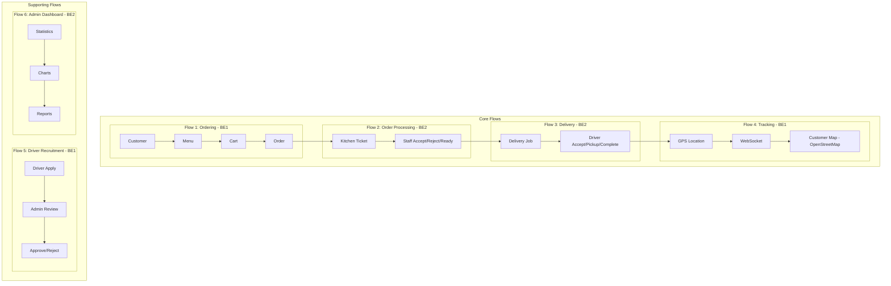
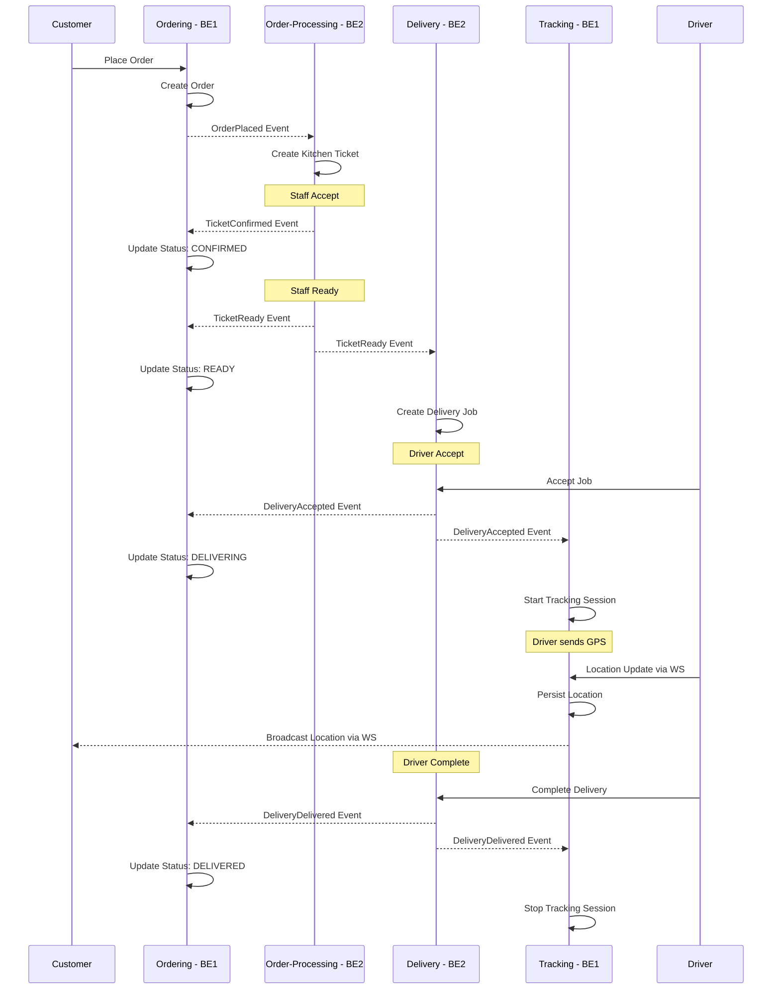
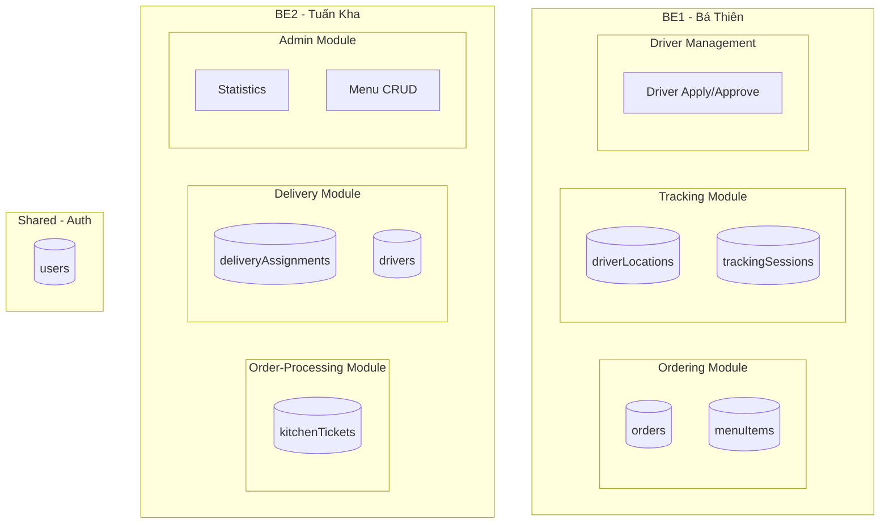

# Food Delivery - Milestone Plan (Tuần 1-11)

## Tổng quan Team & Phân công

| Thành viên | Vai trò | Flows phụ trách | Modules |
|------------|---------|-----------------|---------|
| **Thanh Phúc (FE1)** | Frontend Lead | FE cho Flow 1, 2, 5 | Customer UI, Staff UI, Driver Apply |
| **Tuấn Kiệt (FE2)** | Frontend Developer | FE cho Flow 3, 4, 6 | Driver UI, Tracking Map, Admin UI |
| **Bá Thiên (BE1)** | Backend Developer | Flow 1, 4, 5 | Ordering, Tracking, Driver Recruitment |
| **Tuấn Kha (BE2)** | Backend Developer | Flow 2, 3, 6 | Order-Processing, Delivery, Admin Stats |

## 6 Flows

### Core Flows
| Flow | Tên | Mô tả | Backend | Frontend |
|------|-----|-------|---------|----------|
| **Flow 1** | Ordering | Customer đặt hàng → Menu, Cart, Order | BE1 | FE1 |
| **Flow 2** | Order Processing | Staff xử lý đơn → Queue, Accept/Reject/Ready | BE2 | FE1 |
| **Flow 3** | Delivery | Driver nhận đơn → Jobs, Accept, Pickup, Complete | BE2 | FE2 |
| **Flow 4** | Tracking | Realtime GPS → Driver location, Customer tracking | BE1 | FE2 |

### Supporting Flows
| Flow | Tên | Mô tả | Backend | Frontend |
|------|-----|-------|---------|----------|
| **Flow 5** | Driver Recruitment | Driver apply → Admin approve/reject | BE1 | FE1 + FE2 |
| **Flow 6** | Admin Dashboard | Statistics, Reports, Management | BE2 | FE2 |

## Tech Stack

- **Backend**: NestJS + MongoDB (Mongoose), Modular Monolith + Event-Driven
- **Frontend**: Next.js 16 + React 19, Feature modules (BCE pattern)
- **Realtime**: WebSocket (Nest Gateway)
- **Maps**: OpenStreetMap (Leaflet.js)

---

## Flow Overview Diagram



---

# Milestone 1: Foundation + Flow 1 (Tuần 1-4)

**Mục tiêu**: Setup project hoàn chỉnh + Customer có thể đặt hàng end-to-end

**Demo cuối M1**: Customer login → xem menu → thêm vào cart → place order → xem order status

## Tuần 1-2: Foundation + Auth

| Task | Task Description | Assignment | Output | Status |
|------|------------------|------------|--------|--------|
| BE | Setup NestJS project với ConfigModule + MongoModule | BE1 + BE2 | Backend skeleton chạy được | ⬜ |
| BE | Setup EventingModule với EventEmitter + EventBusPort | BE1 | Event bus infrastructure | ⬜ |
| BE | Auth module: User schema + JWT authentication | BE2 | POST /auth/login, POST /auth/register | ⬜ |
| BE | Role-based guards (Customer, Staff, Driver, Admin) | BE2 | @Roles decorator + RolesGuard | ⬜ |
| BE | Seed data: users với 4 roles khác nhau | BE1 + BE2 | npm run seed | ⬜ |
| FE | Setup Next.js 16 project với App Router | FE1 | Frontend skeleton | ⬜ |
| FE | Setup infrastructure layer: API client + auth storage | FE1 | src/infrastructure/api/ | ⬜ |
| FE | Route groups skeleton: customer/staff/driver/admin | FE1 + FE2 | App router groups | ⬜ |
| FE | Login page + AuthContext | FE1 | /login page hoạt động | ⬜ |
| FE | Protected routes + redirect theo role | FE2 | Unauthorized redirect | ⬜ |

## Tuần 3-4: Flow 1 - Ordering (BE1 + FE1)

| Task | Task Description | Assignment | Output | Status |
|------|------------------|------------|--------|--------|
| BE | Ordering module skeleton + Order entity | BE1 | src/modules/ordering/ | ⬜ |
| BE | Order schema + OrderRepoMongo | BE1 | orders collection | ⬜ |
| BE | Menu module: MenuItem schema + seed data | BE1 | GET /menu | ⬜ |
| BE | PlaceOrderUseCase + publish OrderPlaced event | BE1 | POST /orders | ⬜ |
| BE | GetOrderUseCase | BE1 | GET /orders/:id | ⬜ |
| BE | GetCustomerOrdersUseCase | BE1 | GET /orders?customerId= | ⬜ |
| FE | Menu page: hiển thị danh sách món | FE1 | /(customer)/menu | ⬜ |
| FE | MenuItemCard component | FE1 | Component hiển thị món | ⬜ |
| FE | CartContext + useCart hook | FE1 | Cart state management | ⬜ |
| FE | Cart page: xem giỏ hàng + checkout | FE1 | /(customer)/cart | ⬜ |
| FE | Place order flow: gọi API + redirect | FE1 | Checkout hoạt động | ⬜ |
| FE | Order detail page: hiển thị status | FE2 | /(customer)/orders/[orderId] | ⬜ |
| FE | Order history page | FE2 | /(customer)/orders | ⬜ |

### M1 Deliverables
- ✅ Backend + Frontend chạy được
- ✅ Auth hoạt động với 4 roles
- ✅ Customer đặt hàng thành công
- ✅ Order status hiển thị đúng

---

# Milestone 2: Flow 2 - Staff Workflow (Tuần 5-6)

**Mục tiêu**: Staff có thể xử lý đơn hàng (Accept/Reject/Ready)

**Demo cuối M2**: Customer đặt → Staff thấy ticket → Accept/Reject/Ready → Customer thấy status đổi

## Tuần 5: Order Processing Backend (BE2)

| Task | Task Description | Assignment | Output | Status |
|------|------------------|------------|--------|--------|
| BE | Order-processing module skeleton | BE2 | src/modules/order-processing/ | ⬜ |
| BE | KitchenTicket entity + schema | BE2 | kitchenTickets collection | ⬜ |
| BE | OrderEventsSubscriber: OrderPlaced → create ticket | BE2 | Auto-create ticket khi có order | ⬜ |
| BE | GetPendingTicketsUseCase | BE2 | GET /tickets?status=PENDING | ⬜ |
| BE | GetTicketByIdUseCase | BE2 | GET /tickets/:id | ⬜ |
| BE | AcceptTicketUseCase + publish TicketConfirmed | BE2 | POST /tickets/:id/accept | ⬜ |
| BE | RejectTicketUseCase + publish TicketRejected | BE2 | POST /tickets/:id/reject | ⬜ |
| BE | MarkReadyUseCase + publish TicketReady | BE2 | POST /tickets/:id/ready | ⬜ |
| BE | TicketEventsSubscriber trong ordering module | BE1 | Update order status từ ticket events | ⬜ |
| BE | Event contracts chuẩn hóa | BE1 + BE2 | Ticket events class-based | ⬜ |

## Tuần 6: Staff UI (FE1)

| Task | Task Description | Assignment | Output | Status |
|------|------------------|------------|--------|--------|
| FE | Staff tickets queue page | FE1 | /(staff)/orders | ⬜ |
| FE | Ticket list component với filter status | FE1 | List PENDING tickets | ⬜ |
| FE | Ticket detail page | FE1 | /(staff)/orders/[orderId] | ⬜ |
| FE | Accept/Reject/Ready buttons với confirmation | FE1 | Action buttons hoạt động | ⬜ |
| FE | Auto-refresh ticket list (polling 5s) | FE1 | Real-time update | ⬜ |
| FE | Customer order detail: polling status | FE2 | Customer thấy status đổi | ⬜ |
| FE | Status badge component | FE1 + FE2 | Shared UI component | ⬜ |
| FE | Status mapping: TicketStatus → OrderStatus | FE1 | Mapping documented | ⬜ |

### M2 Deliverables
- ✅ Ticket tự động tạo khi có order
- ✅ Staff Accept/Reject/Ready hoạt động
- ✅ Order status sync với ticket status
- ✅ Customer thấy status update

---

# Milestone 3: Flow 3 + Flow 4 - Delivery & Tracking (Tuần 7-8)

**Mục tiêu**: Driver nhận đơn + Realtime GPS tracking với OpenStreetMap

**Demo cuối M3**: Staff READY → Driver accept → Driver gửi location → Customer thấy trên map

## Tuần 7: Delivery (BE2) + Tracking Backend (BE1)

| Task | Task Description | Assignment | Output | Status |
|------|------------------|------------|--------|--------|
| BE | Delivery module skeleton | BE2 | src/modules/delivery/ | ⬜ |
| BE | DeliveryAssignment entity + schema | BE2 | deliveryAssignments collection | ⬜ |
| BE | Driver entity + schema | BE2 | drivers collection | ⬜ |
| BE | TicketEventsSubscriber: TicketReady → create job | BE2 | Auto-create delivery job | ⬜ |
| BE | GetAvailableJobsUseCase | BE2 | GET /delivery/jobs | ⬜ |
| BE | AcceptDeliveryUseCase + publish DeliveryAccepted | BE2 | POST /delivery/jobs/:id/accept | ⬜ |
| BE | PickupUseCase + publish DeliveryPickedUp | BE2 | POST /delivery/jobs/:id/pickup | ⬜ |
| BE | CompleteDeliveryUseCase + publish DeliveryDelivered | BE2 | POST /delivery/jobs/:id/complete | ⬜ |
| BE | Tracking module skeleton | BE1 | src/modules/tracking/ | ⬜ |
| BE | LocationPoint + TrackingSession entities | BE1 | Tracking entities | ⬜ |
| BE | Location schema + Session schema | BE1 | driverLocations, trackingSessions | ⬜ |
| BE | DeliveryEventsSubscriber: start/stop session | BE1 | Auto manage tracking session | ⬜ |
| BE | PublishLocationUseCase | BE1 | Persist driver location | ⬜ |
| BE | DeliveryEventsSubscriber trong ordering | BE1 | Update order status DELIVERING/DELIVERED | ⬜ |

## Tuần 8: WebSocket + Driver/Customer UI

| Task | Task Description | Assignment | Output | Status |
|------|------------------|------------|--------|--------|
| BE | WebSocket Gateway setup | BE1 | TrackingGateway | ⬜ |
| BE | WS: driver emit location event | BE1 | driver:location channel | ⬜ |
| BE | WS: customer subscribe order tracking | BE1 | tracking:subscribe channel | ⬜ |
| BE | WS authentication middleware | BE1 | JWT verify on WS | ⬜ |
| FE | WebSocket client setup | FE2 | src/infrastructure/realtime/ | ⬜ |
| FE | Driver jobs list page | FE2 | /(driver)/jobs | ⬜ |
| FE | Driver job detail page | FE2 | /(driver)/jobs/[orderId] | ⬜ |
| FE | Driver: Accept job flow | FE2 | Accept button hoạt động | ⬜ |
| FE | Driver: Pickup/Complete flow | FE2 | Status transition buttons | ⬜ |
| FE | Driver: Geolocation API + send location | FE2 | navigator.geolocation | ⬜ |
| FE | Driver: WS emit location interval 5s | FE2 | Auto send GPS | ⬜ |
| FE | Customer tracking page | FE2 | /(customer)/orders/[orderId]/tracking | ⬜ |
| FE | OpenStreetMap integration với Leaflet | FE2 | Map component | ⬜ |
| FE | Customer: WS subscribe + show marker | FE2 | Real-time driver location | ⬜ |
| FE | Customer: Driver marker animation | FE2 | Smooth marker movement | ⬜ |

### M3 Deliverables
- ✅ Delivery job tự động tạo khi ticket ready
- ✅ Driver Accept/Pickup/Complete hoạt động
- ✅ WebSocket realtime location
- ✅ Customer thấy driver trên OpenStreetMap

---

# Milestone 4: Flow 5 + Flow 6 - Admin & Driver Recruitment (Tuần 9-10)

**Mục tiêu**: Admin dashboard + Driver recruitment workflow + UI polish

**Demo cuối M4**: Driver apply → Admin approve + Dashboard statistics + UX hoàn thiện

## Tuần 9: Flow 5 Driver Recruitment (BE1) + Flow 6 Admin Stats (BE2)

| Task | Task Description | Assignment | Output | Status |
|------|------------------|------------|--------|--------|
| BE | Driver apply endpoint | BE1 | POST /drivers/apply | ⬜ |
| BE | Get pending drivers | BE1 | GET /admin/drivers?status=PENDING | ⬜ |
| BE | Approve driver endpoint | BE1 | POST /admin/drivers/:id/approve | ⬜ |
| BE | Reject driver endpoint | BE1 | POST /admin/drivers/:id/reject | ⬜ |
| BE | Get all drivers với filter | BE1 | GET /admin/drivers | ⬜ |
| BE | Driver status validation | BE1 | Only approved drivers can accept jobs | ⬜ |
| BE | Statistics: total orders | BE2 | GET /admin/stats/orders | ⬜ |
| BE | Statistics: total revenue | BE2 | GET /admin/stats/revenue | ⬜ |
| BE | Statistics: daily chart data | BE2 | GET /admin/stats/daily | ⬜ |
| BE | Statistics: orders by status | BE2 | GET /admin/stats/by-status | ⬜ |
| BE | Menu management: CRUD | BE2 | POST/PUT/DELETE /admin/menu | ⬜ |

## Tuần 10: Admin UI + Polish

| Task | Task Description | Assignment | Output | Status |
|------|------------------|------------|--------|--------|
| FE | Admin dashboard page | FE2 | /(admin)/dashboard | ⬜ |
| FE | Stats summary cards | FE2 | Total orders, revenue, etc. | ⬜ |
| FE | Daily orders chart | FE2 | Chart component | ⬜ |
| FE | Admin drivers page | FE2 | /(admin)/drivers | ⬜ |
| FE | Driver list với filter status | FE2 | List pending/approved/rejected | ⬜ |
| FE | Approve/Reject driver modal | FE2 | Confirmation modal | ⬜ |
| FE | Driver apply page | FE1 | /(driver)/apply | ⬜ |
| FE | Driver apply form | FE1 | Form với validation | ⬜ |
| FE | Menu management page | FE2 | /(admin)/menu | ⬜ |
| FE | Error states cho tất cả pages | FE1 + FE2 | Error boundaries | ⬜ |
| FE | Loading states cho tất cả pages | FE1 + FE2 | Skeleton loaders | ⬜ |
| FE | Empty states cho lists | FE1 + FE2 | Empty state components | ⬜ |
| FE | Toast notifications | FE1 + FE2 | Success/error toasts | ⬜ |
| BE | Hardening: validation rules | BE1 + BE2 | DTO validation | ⬜ |
| BE | Hardening: error handling | BE1 + BE2 | Exception filters | ⬜ |

### M4 Deliverables
- ✅ Driver recruitment workflow hoàn chỉnh
- ✅ Admin dashboard với statistics
- ✅ Menu management
- ✅ UI polish hoàn thiện

---

# Milestone 5: Integration + Demo Prep (Tuần 11)

**Mục tiêu**: Integration testing + Bug fixes + Demo preparation

**Demo cuối M5**: Full demo flow từ Customer → Staff → Driver → Customer tracking

## Tuần 11: Final Integration

| Task | Task Description | Assignment | Output | Status |
|------|------------------|------------|--------|--------|
| BE | E2E test: Order flow (Flow 1 → 2) | BE1 + BE2 | Test order → ticket | ⬜ |
| BE | E2E test: Delivery flow (Flow 3) | BE2 | Test ticket → delivery | ⬜ |
| BE | E2E test: Tracking flow (Flow 4) | BE1 | Test WS location update | ⬜ |
| BE | E2E test: Driver recruitment (Flow 5) | BE1 | Test apply → approve | ⬜ |
| BE | Seed data cho demo | BE1 + BE2 | Complete seed script | ⬜ |
| BE | API documentation | BE1 + BE2 | Swagger/OpenAPI docs | ⬜ |
| BE | Docker compose production | BE1 | docker-compose.prod.yml | ⬜ |
| BE | Environment config | BE1 + BE2 | .env.example updated | ⬜ |
| FE | E2E smoke test | FE1 + FE2 | Manual test script | ⬜ |
| FE | Bug fixes từ testing | FE1 + FE2 | Fix reported bugs | ⬜ |
| FE | Demo script preparation | FE1 | Step-by-step demo guide | ⬜ |
| FE | README update | FE1 + FE2 | Setup instructions | ⬜ |
| ALL | Integration testing | All | Full flow testing | ⬜ |
| ALL | Bug fixes | All | Fix critical bugs | ⬜ |
| ALL | Demo rehearsal | All | Practice demo | ⬜ |
| ALL | Final documentation | All | Complete docs | ⬜ |

### M5 Deliverables
- ✅ All 6 flows hoạt động end-to-end
- ✅ Demo script ready
- ✅ Documentation complete
- ✅ Ready for presentation

---

## Status Legend

| Symbol | Meaning |
|--------|---------|
| ⬜ | Not Started |
| 🔄 | In Progress |
| ✅ | Completed |
| ❌ | Blocked |

---

## Event Flow Diagram



---

## Module Ownership



---

## Frontend Pages Assignment

```mermaid
flowchart TB
    subgraph FE1[FE1 - Thanh Phúc]
        Login[/login]
        Menu[/customer/menu]
        Cart[/customer/cart]
        StaffQueue[/staff/orders]
        StaffDetail[/staff/orders/id]
        DriverApply[/driver/apply]
    end
    
    subgraph FE2[FE2 - Tuấn Kiệt]
        OrderHistory[/customer/orders]
        OrderDetail[/customer/orders/id]
        Tracking[/customer/orders/id/tracking]
        DriverJobs[/driver/jobs]
        DriverJobDetail[/driver/jobs/id]
        AdminDashboard[/admin/dashboard]
        AdminDrivers[/admin/drivers]
        AdminMenu[/admin/menu]
    end
    
    subgraph Shared[Shared Components]
        StatusBadge[StatusBadge]
        ErrorBoundary[ErrorBoundary]
        LoadingSkeleton[LoadingSkeleton]
        Toast[Toast]
    end
```

---

## API Endpoints Summary

### Auth (BE2)
- `POST /auth/register` - Đăng ký user
- `POST /auth/login` - Đăng nhập
- `GET /auth/me` - Lấy thông tin user hiện tại

### Ordering - Flow 1 (BE1)
- `GET /menu` - Lấy danh sách món
- `POST /orders` - Đặt hàng
- `GET /orders/:id` - Lấy chi tiết order
- `GET /orders` - Lấy danh sách orders (filter by customerId)

### Order-Processing - Flow 2 (BE2)
- `GET /tickets` - Lấy danh sách tickets (filter by status)
- `GET /tickets/:id` - Lấy chi tiết ticket
- `POST /tickets/:id/accept` - Staff accept ticket
- `POST /tickets/:id/reject` - Staff reject ticket
- `POST /tickets/:id/ready` - Staff mark ready

### Delivery - Flow 3 (BE2)
- `GET /delivery/jobs` - Lấy danh sách jobs (filter by status)
- `POST /delivery/jobs/:id/accept` - Driver accept job
- `POST /delivery/jobs/:id/pickup` - Driver pickup
- `POST /delivery/jobs/:id/complete` - Driver complete

### Tracking - Flow 4 (BE1)
- `GET /tracking/:orderId/last` - Lấy last location
- `WS driver:location` - Driver emit location
- `WS tracking:subscribe` - Customer subscribe

### Driver Recruitment - Flow 5 (BE1)
- `POST /drivers/apply` - Driver đăng ký
- `GET /admin/drivers` - List drivers (filter by status)
- `POST /admin/drivers/:id/approve` - Approve driver
- `POST /admin/drivers/:id/reject` - Reject driver

### Admin Dashboard - Flow 6 (BE2)
- `GET /admin/stats/summary` - Statistics summary
- `GET /admin/stats/daily` - Daily chart data
- `GET /admin/stats/by-status` - Orders by status
- `POST /admin/menu` - Create menu item
- `PUT /admin/menu/:id` - Update menu item
- `DELETE /admin/menu/:id` - Delete menu item

---

## Notes

1. **OpenStreetMap**: Sử dụng Leaflet.js cho map integration, không dùng Google Maps
2. **Event-Driven**: Modules giao tiếp qua Domain Events, không trực tiếp access DB của module khác
3. **BCE Pattern**: Cả Backend và Frontend đều follow Boundary/Control/Entity pattern
4. **WebSocket**: Dùng Nest Gateway cho realtime, có fallback polling nếu WS fail
5. **Cross-module Events**: 
   - BE1 (Ordering) subscribe events từ BE2 (Order-Processing, Delivery)
   - BE1 (Tracking) subscribe events từ BE2 (Delivery)
