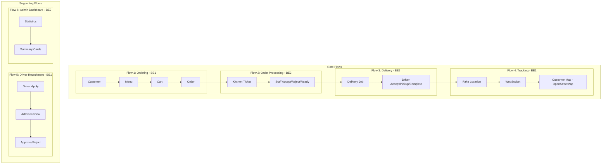
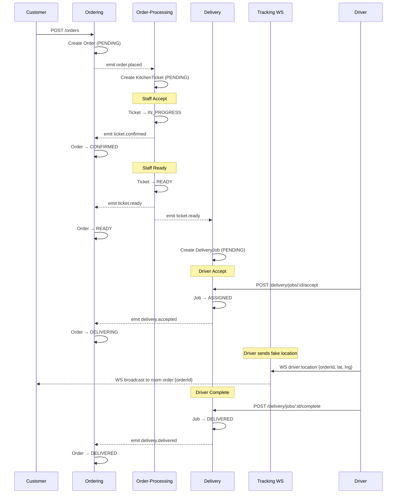
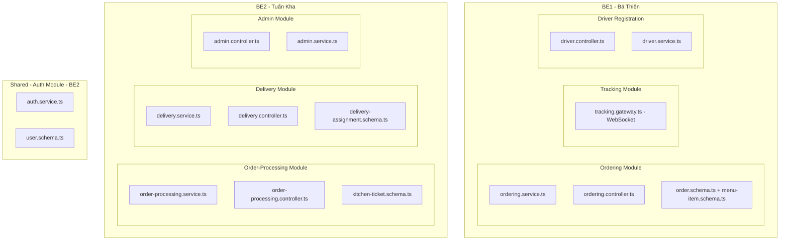

# Food Delivery - Milestone Plan (Tuần 1-11)

> **Scope**: Demo cho giảng viên, 4-7 concurrent users, không production.
> **Architecture**: Modular Monolith + Event-Driven (simplified), Feature-based Frontend.

## Tổng quan Team & Phân công

| Thành viên | Vai trò | Flows phụ trách | Modules |
|------------|---------|-----------------|---------|
| **Thanh Phúc (FE1)** | Frontend Lead | FE cho Flow 1, 2, 5 | Customer UI, Staff UI, Driver Apply |
| **Tuấn Kiệt (FE2)** | Frontend Developer | FE cho Flow 3, 4, 6 | Driver UI, Tracking Map, Admin UI |
| **Bá Thiên (BE1)** | Backend Developer | Flow 1, 4, 5 | Ordering, Tracking, Driver Recruitment |
| **Tuấn Kha (BE2)** | Backend Developer | Flow 2, 3, 6 | Order-Processing, Delivery, Admin Stats |

## 6 Flows

### Core Flows
| Flow | Tên | Mô tả | Backend | Frontend |
|------|-----|-------|---------|----------|
| **Flow 1** | Ordering | Customer đặt hàng → Menu, Cart, Order | BE1 | FE1 |
| **Flow 2** | Order Processing | Staff xử lý đơn → Queue, Accept/Reject/Ready | BE2 | FE1 |
| **Flow 3** | Delivery | Driver nhận đơn → Jobs, Accept, Pickup, Complete | BE2 | FE2 |
| **Flow 4** | Tracking | Realtime location → Driver gửi vị trí, Customer xem map | BE1 | FE2 |

### Supporting Flows
| Flow | Tên | Mô tả | Backend | Frontend |
|------|-----|-------|---------|----------|
| **Flow 5** | Driver Recruitment | Driver apply → Admin approve/reject | BE1 | FE1 + FE2 |
| **Flow 6** | Admin Dashboard | Statistics + Menu Management | BE2 | FE2 |

## Tech Stack

- **Backend**: NestJS + MongoDB (Mongoose), Modular Monolith + Event-Driven
- **Frontend**: Next.js 16 + React 19, Feature-based modules (`features/` pattern)
- **Realtime**: WebSocket (Nest Gateway + Socket.IO)
- **Maps**: OpenStreetMap (Leaflet.js)

## Backend Module Structure (Simplified)

```
modules/{module-name}/
├── {module}.module.ts          # Module registration
├── {module}.controller.ts      # REST endpoints
├── {module}.service.ts         # Business logic + @OnEvent handlers
└── {entity}.schema.ts          # Mongoose schema (= Entity)
```

Không dùng: ~~boundary/~~, ~~control/~~, ~~entity/~~, ~~ports/~~, ~~infrastructure/~~, ~~UseCase class~~

## Event-Driven (Simplified)

```typescript
// Publish: dùng EventEmitter2 trực tiếp
this.eventEmitter.emit('order.placed', { orderId, items, customerId });

// Subscribe: dùng @OnEvent decorator trong service
@OnEvent('order.placed')
handleOrderPlaced(payload: { orderId: string; items: any[] }) {
  // Tạo KitchenTicket...
}
```

Không dùng: ~~EventBusPort~~, ~~DomainEvent base class~~, ~~event UUID/timestamp~~

---

## Flow Overview Diagram



---

# Milestone 1: Foundation + Flow 1 (Tuần 1-4)

**Mục tiêu**: Setup hoàn chỉnh + Customer đặt hàng end-to-end

**Demo cuối M1**: Customer login → xem menu → thêm vào cart → place order → xem order status

## Tuần 1-2: Foundation + Auth

| Task | Task Description | Assignment | Output | Status |
|------|------------------|------------|--------|--------|
| M1-BE-01 | **Project Setup**: Tạo `.env` (MONGO_URI, JWT_SECRET, PORT=3001). ConfigModule với env validation. MongoModule. `GET /api/health` verify DB. **Enable CORS** cho `http://localhost:3000`. | BE1 + BE2 | Health check + CORS hoạt động | 🔄 |
| M1-BE-02 | **Global Guards**: Register `JwtAuthGuard` + `RolesGuard` làm `APP_GUARD` global trong AppModule. Mọi route default protected, dùng `@Public()` cho route public. | BE2 | Protected routes chặn unauthorized | 🔄 |
| M1-BE-03 | **Auth Module**: User schema (email, passwordHash, role, name). `POST /auth/register` → return `{ token, user }`. `POST /auth/login` → return `{ token, user }` (**key = `token`, không phải `access_token`**). `GET /auth/me`. | BE2 | 3 auth endpoints, response format khớp FE | 🔄 |
| M1-BE-04 | **Seed Users + Menu**: Script `npm run seed` tạo 4 test users (customer/staff/driver/admin @test.com, pass: 123456) + 10 menu items với categories. Chạy nhiều lần không duplicate. | BE1 + BE2 | `npm run seed` hoạt động | 🔄 |
| M1-FE-01 | **Next.js Setup**: App Router, TypeScript, ESLint, feature-based structure. | FE1 | `npm run dev` chạy được | ✅ |
| M1-FE-02 | **API Infrastructure**: Axios wrapper `lib/api.ts` (baseURL: `localhost:3001/api`). JWT interceptor. 401 → redirect login. | FE1 | API client hoạt động | ✅ |
| M1-FE-03 | **Route Groups + Layouts**: Layout riêng cho `(customer)`, `(staff)`, `(driver)`, `(admin)`. Customer + Driver: BottomNav. Staff + Admin: Sidebar. | FE1 + FE2 | 4 route groups với layouts | 🔄 |
| M1-FE-04 | **Login Page**: Form login → gọi `POST /auth/login` → lưu JWT → redirect theo role. AuthContext + useAuth hook. | FE1 | `/login` hoạt động end-to-end | ✅ |

## Tuần 3-4: Flow 1 - Ordering

| Task | Task Description | Assignment | Output | Status |
|------|------------------|------------|--------|--------|
| M1-BE-05 | **Order Schema**: Mongoose schema: customerId, items[{menuItemId, name, quantity, unitPrice}], totalAmount, status (PENDING/CONFIRMED/PREPARING/READY/DELIVERING/DELIVERED/CANCELLED), deliveryAddress, createdAt. | BE1 | `orders` collection | 🔄 |
| M1-BE-06 | **Menu Endpoints**: `GET /api/menu` trả list tất cả menu items. `GET /api/menu?category=Main` filter by category. Public endpoint (`@Public()`). | BE1 | Menu API hoạt động | ⬜ |
| M1-BE-07 | **Order Endpoints**: `POST /api/orders` tạo order (validate items exist, tính totalAmount, status=PENDING, **emit `order.placed` event**). `GET /api/orders/my` lấy orders của user đang login. `GET /api/orders/:id` lấy chi tiết. | BE1 | 3 order endpoints + event emit | ⬜ |
| M1-FE-05 | **Menu Page**: Fetch `GET /menu`. Filter tabs by category. Hiển thị grid MenuItemCard. Nút "Add to Cart". | FE1 | `/(customer)/menu` | ✅ |
| M1-FE-06 | **Cart State + Page**: CartContext (useState, không cần localStorage). addItem, removeItem, updateQuantity, clearCart. Cart page hiển thị items + delivery address form + "Place Order" button. | FE1 | `/(customer)/cart` hoạt động | ✅ |
| M1-FE-07 | **Checkout Flow**: Gọi `POST /orders`. Loading state. Clear cart on success. Redirect đến order detail. Alert nếu fail. | FE1 | Đặt hàng end-to-end | ⬜ |
| M1-FE-08 | **Order Detail Page**: Fetch order by ID. Hiển thị status badge, items list, total, address. Nút "Refresh" để cập nhật status (không polling). | FE2 | `/(customer)/orders/[id]` | ⬜ |
| M1-FE-09 | **Order History**: Fetch `GET /orders/my`. List cards với status, date, total. Click → navigate detail. Text "Chưa có đơn hàng" nếu empty. | FE2 | `/(customer)/orders` | ⬜ |

### M1 Integration Checkpoint
> ⚠️ **Cuối tuần 4**: FE1 + BE1 ngồi lại test end-to-end trên 1 máy. Verify: login → menu → cart → place order → xem order. Fix mọi lỗi contract trước khi qua M2.

---

# Milestone 2: Flow 2 - Staff Workflow (Tuần 5-6)

**Mục tiêu**: Staff xử lý đơn hàng

**Demo cuối M2**: Customer đặt → Staff thấy ticket → Accept/Reject/Ready → Customer thấy status đổi (sau refresh)

## Tuần 5: Order Processing Backend (BE2)

| Task | Task Description | Assignment | Output | Status |
|------|------------------|------------|--------|--------|
| M2-BE-01 | **KitchenTicket Schema + Service**: Schema: orderId, items[], status (PENDING/IN_PROGRESS/READY/REJECTED), staffId, createdAt, acceptedAt, readyAt. Service xử lý logic create/accept/reject/ready. | BE2 | `kitchenTickets` collection + service | ⬜ |
| M2-BE-02 | **Ticket Endpoints**: `GET /api/tickets` (filter by status). `GET /api/tickets/:id`. `POST /api/tickets/:id/accept`. `POST /api/tickets/:id/reject` (body: {reason}). `POST /api/tickets/:id/ready`. Staff role required. | BE2 | 5 ticket endpoints | ⬜ |
| M2-BE-03 | **Event: order.placed → tạo ticket**: `@OnEvent('order.placed')` trong OrderProcessingService. Tạo KitchenTicket PENDING, copy items từ order. | BE2 | Ticket tự động tạo khi có order | ⬜ |
| M2-BE-04 | **Events: ticket → update order**: `@OnEvent('ticket.confirmed')` → order CONFIRMED. `@OnEvent('ticket.rejected')` → order CANCELLED. `@OnEvent('ticket.ready')` → order READY. Viết trong OrderingService. | BE1 | Order status sync với ticket | ⬜ |

## Tuần 6: Staff UI (FE1)

| Task | Task Description | Assignment | Output | Status |
|------|------------------|------------|--------|--------|
| M2-FE-01 | **Staff Queue Page**: Layout 2 cột: Pending (trái), In-Progress (phải). Count badge mỗi cột. Nút "Refresh" để load lại. | FE1 | `/(staff)/tickets` | ⬜ |
| M2-FE-02 | **Ticket Card + Actions**: Card hiển thị order ID, items count, thời gian tạo. PENDING: nút Accept + Reject. IN_PROGRESS: nút Ready. Reject cần confirm + nhập reason. | FE1 | TicketCard component | ⬜ |
| M2-FE-03 | **Ticket Detail Page**: Full ticket info: items list, customer address, timestamps. Action buttons theo status. Back button về queue. | FE1 | `/(staff)/tickets/[id]` | ⬜ |
| M2-FE-04 | **Status Badge Component**: Shared component. PENDING: yellow, CONFIRMED: blue, PREPARING: orange, READY: green, DELIVERING: purple, DELIVERED: green, CANCELLED: red. | FE1 + FE2 | `OrderStatusBadge` reusable | ⬜ |

### M2 Integration Checkpoint
> ⚠️ **Cuối tuần 6**: Test cross-module event flow. Customer đặt hàng → ticket xuất hiện ở Staff → Staff accept → Customer refresh thấy CONFIRMED.

---

# Milestone 3: Flow 3 + Flow 4 - Delivery & Tracking (Tuần 7-9)

**Mục tiêu**: Driver nhận đơn + Customer thấy vị trí driver trên map

**Demo cuối M3**: Staff READY → Driver accept → Driver gửi fake location → Customer thấy trên map

## Tuần 7: Delivery Backend (BE2) + Tracking Backend (BE1)

| Task | Task Description | Assignment | Output | Status |
|------|------------------|------------|--------|--------|
| M3-BE-01 | **DeliveryAssignment Schema + Service**: Schema: orderId, driverId, status (PENDING/ASSIGNED/PICKED_UP/DELIVERED), pickupAddress, deliveryAddress, timestamps. Service: create/accept/pickup/complete. | BE2 | `deliveryAssignments` collection | ⬜ |
| M3-BE-02 | **Delivery Endpoints**: `GET /api/delivery/jobs` (PENDING jobs cho driver). `POST /api/delivery/jobs/:id/accept`. `POST /api/delivery/jobs/:id/pickup`. `POST /api/delivery/jobs/:id/complete`. Driver role required. | BE2 | 4 delivery endpoints | ⬜ |
| M3-BE-03 | **Event: ticket.ready → tạo delivery job**: `@OnEvent('ticket.ready')` trong DeliveryService. Tạo DeliveryAssignment PENDING. | BE2 | Job tự động tạo khi ticket ready | ⬜ |
| M3-BE-04 | **Events: delivery → update order**: `@OnEvent('delivery.accepted')` → order DELIVERING. `@OnEvent('delivery.delivered')` → order DELIVERED. Viết trong OrderingService. | BE1 | Order status sync với delivery | ⬜ |
| M3-BE-05 | **WebSocket Gateway**: NestJS Gateway với Socket.IO. Event `driver:location` nhận {orderId, lat, lng} → broadcast tới room `order:{orderId}`. Event `tracking:subscribe` → join room. Dùng query param `token` cho auth (không cần WS middleware phức tạp). | BE1 | WebSocket broadcast hoạt động | ⬜ |

## Tuần 8-9: Driver + Customer UI (FE2)

| Task | Task Description | Assignment | Output | Status |
|------|------------------|------------|--------|--------|
| M3-FE-01 | **Driver Jobs Page**: Fetch available jobs. Card: pickup/delivery address, items count. Nút "Refresh". Empty state text. | FE2 | `/(driver)/jobs` | ⬜ |
| M3-FE-02 | **Driver Job Actions**: Accept → status ASSIGNED. "Đã lấy hàng" → PICKED_UP. "Hoàn thành" → DELIVERED. Confirm trước mỗi action. | FE2 | Status transitions hoạt động | ⬜ |
| M3-FE-03 | **WebSocket Client**: Setup Socket.IO client (`lib/socket.ts`). Connect với token qua query param. Basic reconnect. | FE2 | WS client hoạt động | ⬜ |
| M3-FE-04 | **Driver Fake Location**: Khi có active job, hiển thị dropdown chọn vị trí giả lập (VD: "Quận 1", "Quận 3", "Gần nhà hàng", "Gần khách hàng") + nút "Gửi vị trí". Emit `driver:location` qua WS mỗi lần click. | FE2 | Driver gửi location giả lập | ⬜ |
| M3-FE-05 | **Customer Tracking Page**: Leaflet.js + OpenStreetMap tiles. Subscribe WS room `order:{orderId}`. Render marker khi nhận location event. Centered trên delivery address. | FE2 | `/(customer)/orders/[id]/tracking` | ⬜ |
| M3-FE-06 | **Map Marker Update**: Nhận WS event → cập nhật marker position (nhảy thẳng, không cần animation). Marker hiển thị icon driver. | FE2 | Marker realtime update | ⬜ |

### M3 Integration Checkpoint
> ⚠️ **Cuối tuần 9**: Full flow test. Customer đặt → Staff ready → Driver accept → Driver gửi fake location → Customer thấy marker trên map.

---

# Milestone 4: Flow 5 + Flow 6 - Admin & Driver Recruitment (Tuần 10)

**Mục tiêu**: Admin dashboard + Driver recruitment + Menu management

**Demo cuối M4**: Driver apply → Admin approve + Dashboard stats

## Tuần 10: Admin + Driver Features

| Task | Task Description | Assignment | Output | Status |
|------|------------------|------------|--------|--------|
| M4-BE-01 | **Driver Registration**: Driver schema (userId, status, vehicleType, licensePlate, phone). `POST /api/drivers/apply` (Customer role). `GET /api/admin/drivers` (filter status). `POST /api/admin/drivers/:id/approve` (update role → DRIVER). `POST /api/admin/drivers/:id/reject`. Admin role required. | BE1 | Driver CRUD endpoints | ⬜ |
| M4-BE-02 | **Admin Stats**: `GET /api/admin/stats` return {totalOrders, todayOrders, totalRevenue, activeDrivers}. Dùng MongoDB `countDocuments` + `aggregate`. Admin role required. | BE2 | Stats endpoint | ⬜ |
| M4-BE-03 | **Menu CRUD**: `POST /api/admin/menu` create. `PUT /api/admin/menu/:id` update. `DELETE /api/admin/menu/:id` (set available=false). Admin role required. | BE2 | Menu management endpoints | ⬜ |
| M4-FE-01 | **Driver Apply Page**: Form: Vehicle Type (dropdown), License Plate, Phone. Submit → gọi API. Show success message. Nếu đã apply → show status hiện tại. | FE1 | `/(driver)/apply` | ⬜ |
| M4-FE-02 | **Admin Dashboard**: Stats summary cards (4 cards: Total Orders, Today, Revenue, Drivers). Fetch từ stats API. | FE2 | `/(admin)/dashboard` | ⬜ |
| M4-FE-03 | **Admin Drivers Page**: Table danh sách drivers. Tab filter: All/Pending/Approved/Rejected. Nút Approve/Reject mỗi row. Reject cần nhập reason. | FE2 | `/(admin)/drivers` | ⬜ |
| M4-FE-04 | **Admin Menu Page**: Table CRUD menu items. Nút Add → modal form. Nút Edit/Delete mỗi row. | FE2 | `/(admin)/menu` | ⬜ |

---

# Milestone 5: Integration + Demo Prep (Tuần 11)

**Mục tiêu**: Integration testing + Bug fixes + Demo preparation

**Demo cuối M5**: Full demo flow Customer → Staff → Driver → Customer tracking

## Tuần 11: Final Integration

| Task | Task Description | Assignment | Output | Status |
|------|------------------|------------|--------|--------|
| M5-01 | **Demo Seed Data**: Hoàn thiện seed script: 4 users, 10 menu items, 5 sample orders (các status khác nhau), 2 approved drivers, 1 pending driver. Data thực tế. | BE1 + BE2 | `npm run seed:demo` | ⬜ |
| M5-02 | **Integration Testing**: Full team test tất cả 6 flows end-to-end trên 1 máy. Checklist: Login 4 roles → Customer order → Staff process → Driver deliver → Track on map → Admin approve driver. | All | All flows verified | ⬜ |
| M5-03 | **Bug Fixes**: Fix tất cả bugs từ integration testing. Priority: flow-breaking > UI > cosmetic. | All | Zero flow-breaking bugs | ⬜ |
| M5-04 | **Demo Script + Rehearsal**: Step-by-step demo guide: login credentials, demo sequence, talking points. Practice 2 lần. Backup plan nếu feature fail. | All | Demo ready (15-20 phút) | ⬜ |
| M5-05 | **Documentation**: README (setup + run), Architecture diagram, API endpoints summary. Consolidate vào `/docs`. | All | Docs hoàn chỉnh | ⬜ |

---

## Status Legend

| Symbol | Meaning |
|--------|---------|
| ⬜ | Not Started |
| 🔄 | In Progress |
| ✅ | Completed |
| ❌ | Blocked |

---

## Event Flow Diagram



**6 Events (cross-module):**
1. `order.placed` → Order-Processing tạo ticket
2. `ticket.confirmed` → Ordering: order CONFIRMED
3. `ticket.ready` → Ordering: order READY + Delivery: tạo job
4. `delivery.accepted` → Ordering: order DELIVERING
5. `delivery.delivered` → Ordering: order DELIVERED

> `ticket.rejected` → Ordering: order CANCELLED (bonus, gọi trực tiếp cũng được)

---

## Module Ownership



---

## Frontend Pages Assignment

```mermaid
flowchart TB
    subgraph FE1[FE1 - Thanh Phúc]
        Login[/login]
        Menu[/(customer)/menu]
        Cart[/(customer)/cart]
        StaffQueue[/(staff)/tickets]
        StaffDetail[/(staff)/tickets/id]
        DriverApply[/(driver)/apply]
    end
    
    subgraph FE2[FE2 - Tuấn Kiệt]
        OrderHistory[/(customer)/orders]
        OrderDetail[/(customer)/orders/id]
        Tracking[/(customer)/orders/id/tracking]
        DriverJobs[/(driver)/jobs]
        AdminDashboard[/(admin)/dashboard]
        AdminDrivers[/(admin)/drivers]
        AdminMenu[/(admin)/menu]
    end
```

---

## API Endpoints Summary

### Auth (BE2) — `@Public()` cho register/login
- `POST /api/auth/register` → `{ token, user }`
- `POST /api/auth/login` → `{ token, user }`
- `GET /api/auth/me` → `{ id, email, role, name }`

### Ordering - Flow 1 (BE1)
- `GET /api/menu` — `@Public()`, filter: `?category=Main`
- `POST /api/orders` — Customer role, emit `order.placed`
- `GET /api/orders/my` — Customer role
- `GET /api/orders/:id` — Authenticated

### Order-Processing - Flow 2 (BE2)
- `GET /api/tickets` — Staff role, filter: `?status=PENDING`
- `GET /api/tickets/:id` — Staff role
- `POST /api/tickets/:id/accept` — Staff, emit `ticket.confirmed`
- `POST /api/tickets/:id/reject` — Staff, body: `{reason}`
- `POST /api/tickets/:id/ready` — Staff, emit `ticket.ready`

### Delivery - Flow 3 (BE2)
- `GET /api/delivery/jobs` — Driver role (PENDING jobs)
- `POST /api/delivery/jobs/:id/accept` — Driver, emit `delivery.accepted`
- `POST /api/delivery/jobs/:id/pickup` — Driver
- `POST /api/delivery/jobs/:id/complete` — Driver, emit `delivery.delivered`

### Tracking - Flow 4 (BE1)
- `WS driver:location` — Driver emit `{orderId, lat, lng}`
- `WS tracking:subscribe` — Customer join room `{orderId}`

### Driver Recruitment - Flow 5 (BE1)
- `POST /api/drivers/apply` — Customer role
- `GET /api/admin/drivers` — Admin role, filter: `?status=PENDING`
- `POST /api/admin/drivers/:id/approve` — Admin
- `POST /api/admin/drivers/:id/reject` — Admin, body: `{reason}`

### Admin Dashboard - Flow 6 (BE2)
- `GET /api/admin/stats` — Admin role
- `POST /api/admin/menu` — Admin, create menu item
- `PUT /api/admin/menu/:id` — Admin, update
- `DELETE /api/admin/menu/:id` — Admin, soft delete

---

## ⚠️ Known Issues cần fix trước khi tiếp tục

| # | Issue | Fix |
|---|-------|-----|
| 1 | Backend login trả `access_token`, FE expect `token` | BE2: đổi response key thành `token` |
| 2 | Backend register trả `{userId}`, FE expect `{token, user}` | BE2: register trả token + user luôn |
| 3 | CORS chưa enable | BE1: thêm `app.enableCors()` trong main.ts |
| 4 | Guards chưa global | BE2: register APP_GUARD trong AppModule |
| 5 | Order items là `string[]` thay vì structured objects | BE1: sửa schema items[] |
| 6 | Port mismatch (BE default 3000, FE target 3001) | BE1: set PORT=3001 trong .env |
| 7 | Seed script chưa có trong package.json | BE1: thêm `"seed": "ts-node src/seed.ts"` |

---

## Notes

1. **Demo-scope**: 4-7 users, happy path only, không cần pagination/polling/error handling phức tạp
2. **Event-Driven**: Dùng `EventEmitter2` + `@OnEvent()` trực tiếp. 6 events cho cross-module communication
3. **Tracking**: Fake GPS location (dropdown chọn vị trí giả lập), không dùng `navigator.geolocation`
4. **Frontend Architecture**: Feature-based pattern (`features/` chứa service + hook + UI, `components/` chỉ chứa shared UI/layout)
5. **Backend Architecture**: Controller → Service → Schema. Không dùng BCE/Port/Adapter/UseCase class
6. **Refresh**: Manual refresh (nút hoặc F5) thay vì polling/auto-refresh
7. **WebSocket**: Dùng query param `token` cho auth, không cần WS middleware phức tạp
